# Codex 项目架构分析

## 项目概述

Codex 是 OpenAI 开发的本地运行的代码智能助手CLI工具，采用 Rust(后端核心) + TypeScript(CLI包装/SDK) 的混合架构。

---

## 1. 整体架构图

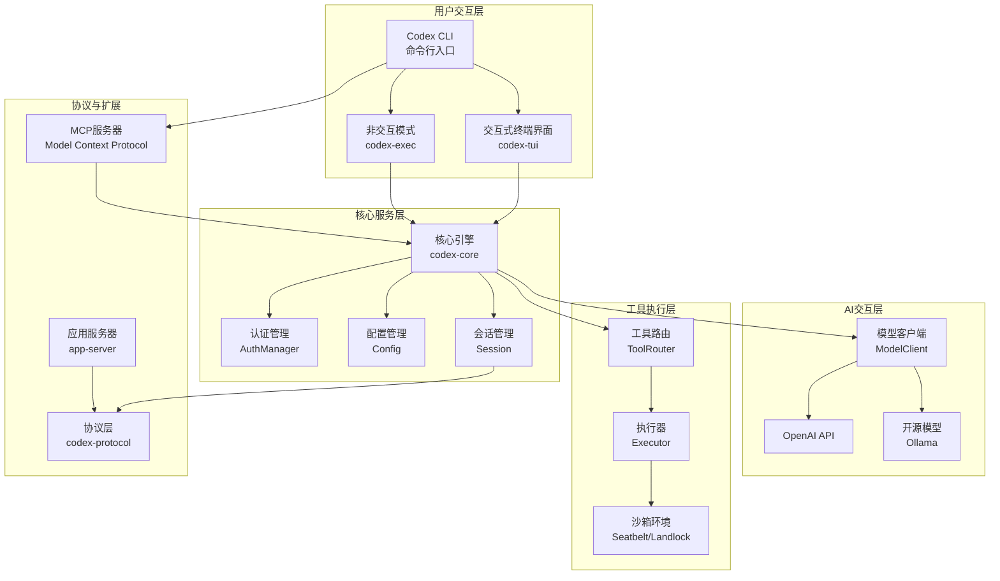

---

## 2. 核心工作流程

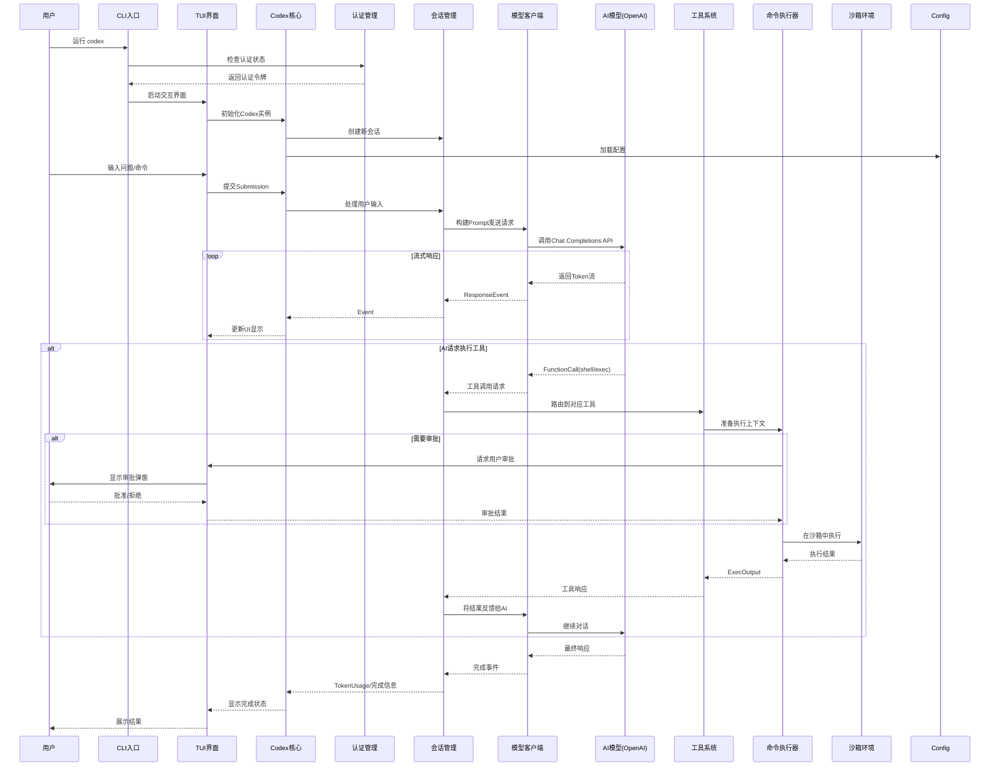

---

## 3. Codex核心引擎架构

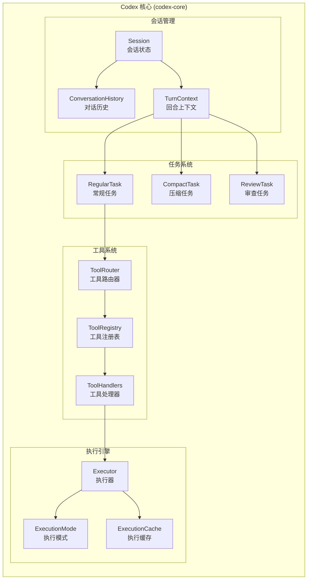

---

## 4. TUI交互界面架构

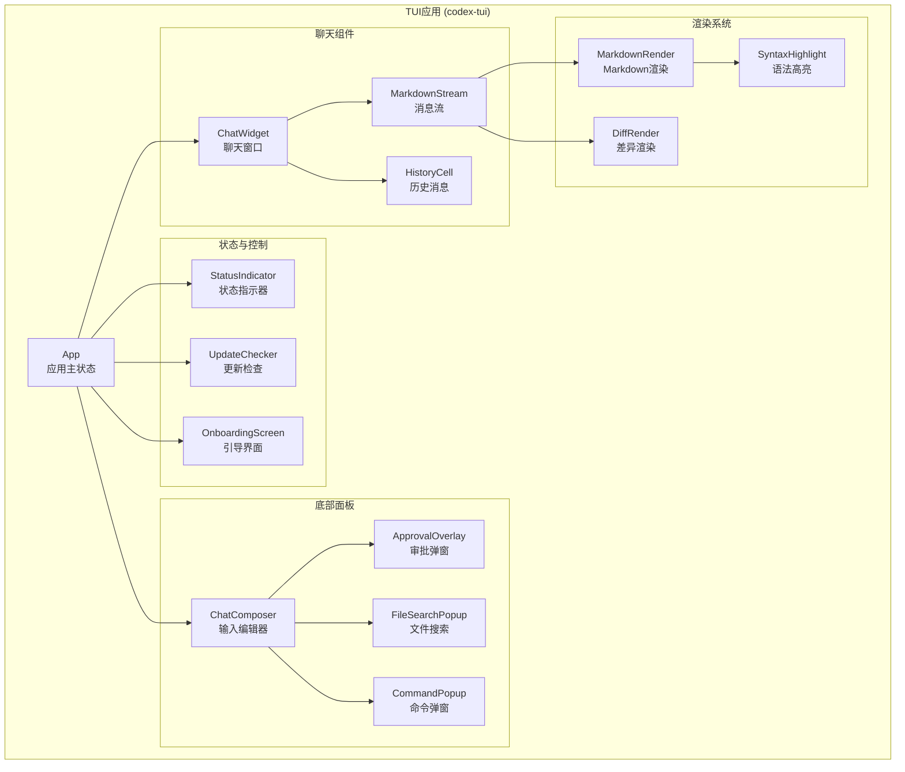

---

## 5. 认证与配置流程

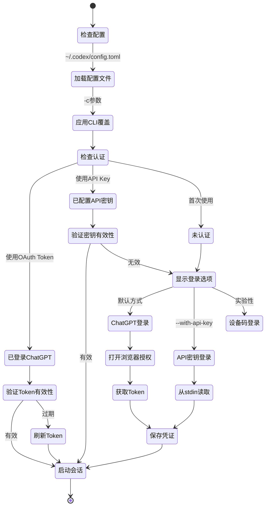

---

## 6. 工具执行与沙箱隔离

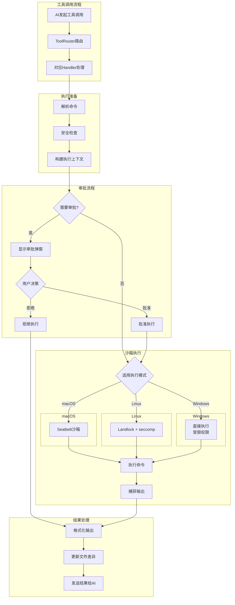

---

## 7. MCP (Model Context Protocol) 架构

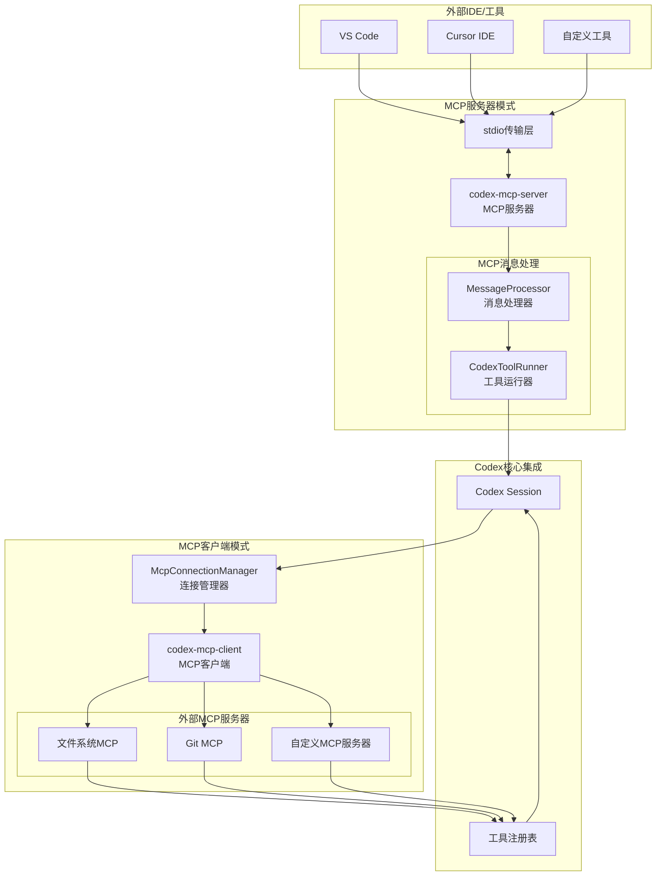

---

## 8. 数据流与事件系统

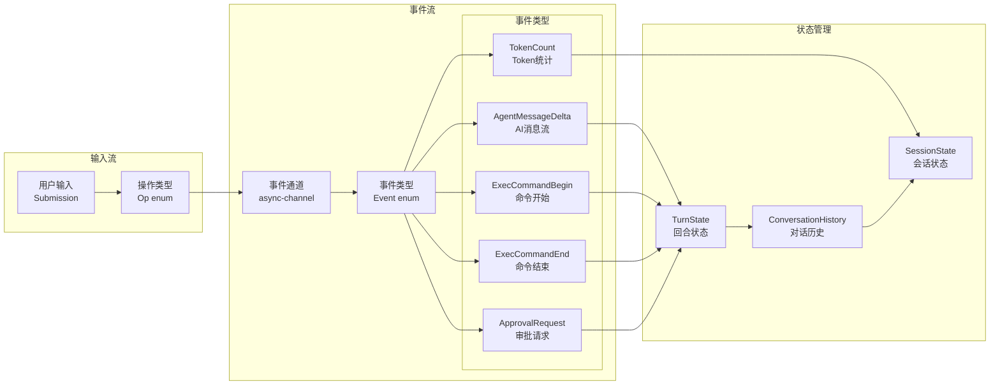

---

## 9. 项目模块关系

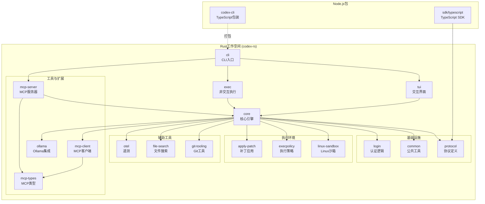

---

## 10. 关键特性实现

### 10.1 会话持久化与恢复

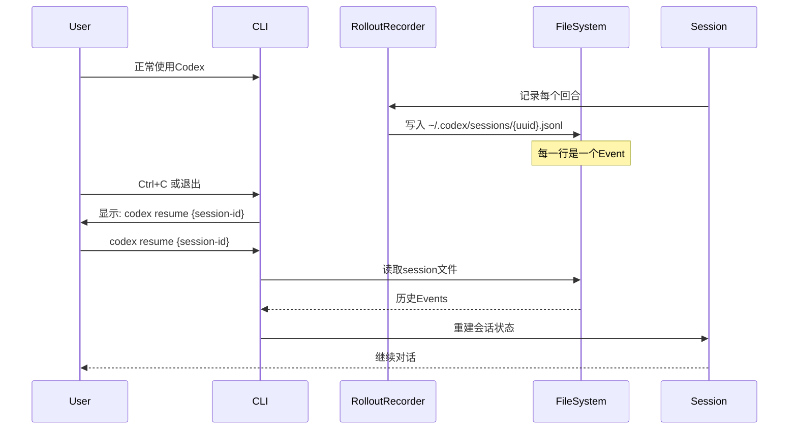

### 10.2 文件差异追踪

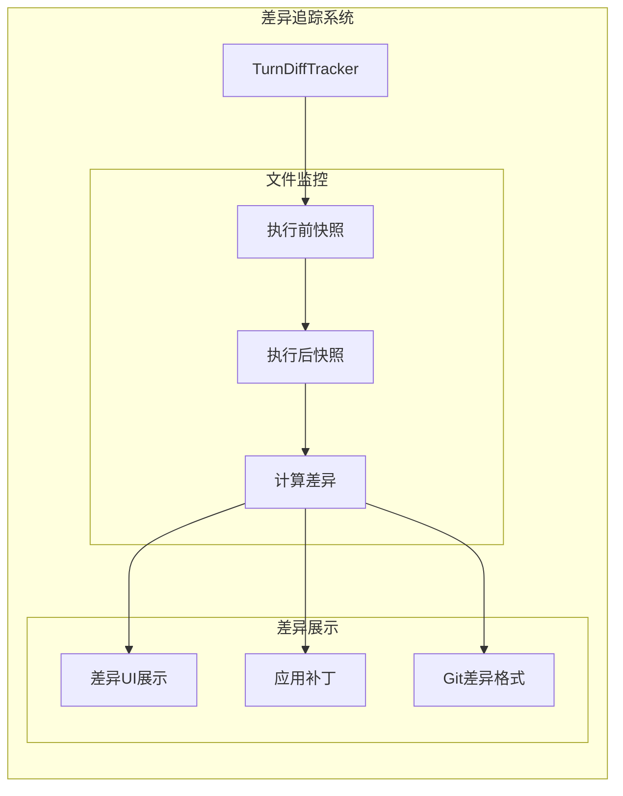

---

## 总结

### 架构亮点

1. **分层清晰**: CLI → TUI/EXEC → Core → Tools/Executor → Sandbox
2. **异步驱动**: 全面使用 Tokio 异步运行时，事件驱动架构
3. **类型安全**: Rust + TypeScript，强类型系统保证安全性
4. **沙箱隔离**: 多平台沙箱支持（Seatbelt/Landlock/seccomp）
5. **可扩展**: MCP协议支持，工具系统插件化
6. **用户友好**: TUI交互式界面，审批机制，会话恢复

### 核心技术栈

- **语言**: Rust (核心) + TypeScript (CLI/SDK)
- **UI框架**: ratatui (终端UI)
- **异步运行时**: Tokio
- **序列化**: serde + serde_json
- **协议**: JSON-RPC (MCP), SSE (流式响应)
- **沙箱**: Seatbelt (macOS), Landlock + seccomp (Linux)

### 数据流向

```
用户输入 → Submission → Codex核心 → ModelClient → AI API
                ↓                            ↓
            Event流 ← ResponseEvent ← 流式响应
                ↓
            TUI更新 ← 工具执行 ← FunctionCall
```

