# Gemini CLI 项目架构分析

## 项目概述

Gemini CLI 是 Google 开发的开源 AI 代码助手命令行工具，完全基于 **TypeScript + Node.js** 构建，提供强大的终端AI交互体验。与 Codex 的 Rust 架构不同，Gemini CLI 采用纯 JavaScript 生态系统。

---

## 1. 整体架构图


---

## 2. 核心工作流程


---

## 3. 包结构与模块关系


---

## 4. 核心类与数据流


---

## 5. Ink UI架构 (React for Terminal)


---

## 6. 工具系统架构

```mermaid
graph TB
    subgraph "工具抽象层"
        BaseDeclarativeTool[BaseDeclarativeTool<br/>基础工具类]
        ToolInvocation[ToolInvocation<br/>工具调用]
        ToolResult[ToolResult<br/>结果封装]
    end
    
    subgraph "内置工具"
        subgraph "文件系统"
            ReadFile[ReadFile<br/>读取文件]
            WriteFile[WriteFile<br/>写入文件]
            EditFile[Edit<br/>编辑文件]
            ListDir[Ls<br/>列出目录]
            Grep[Grep/RipGrep<br/>文本搜索]
            Glob[Glob<br/>文件匹配]
        end
        
        subgraph "执行工具"
            Shell[Shell<br/>执行命令]
        end
        
        subgraph "网络工具"
            WebFetch[WebFetch<br/>HTTP请求]
            WebSearch[WebSearch<br/>Google搜索]
        end
        
        subgraph "辅助工具"
            Memory[Memory<br/>上下文记忆]
            WriteTodos[WriteTodos<br/>待办事项]
        end
    end
    
    subgraph "MCP工具"
        MCPClient[MCPClient<br/>MCP客户端]
        DiscoveredMCPTool[DiscoveredMCPTool<br/>动态发现的工具]
    end
    
    BaseDeclarativeTool --> ToolInvocation
    ToolInvocation --> ToolResult
    
    ReadFile -.继承.-> BaseDeclarativeTool
    WriteFile -.继承.-> BaseDeclarativeTool
    EditFile -.继承.-> BaseDeclarativeTool
    Shell -.继承.-> BaseDeclarativeTool
    WebFetch -.继承.-> BaseDeclarativeTool
    WebSearch -.继承.-> BaseDeclarativeTool
    
    MCPClient --> DiscoveredMCPTool
    DiscoveredMCPTool -.继承.-> BaseDeclarativeTool
```



---

## 7. 认证流程


---

## 8. 工具执行与确认流程


---

## 9. MCP (Model Context Protocol) 集成


---

## 10. 会话管理与Checkpointing


---

## 11. 扩展系统架构


---

## 12. 数据流与状态管理

```mermaid
graph LR
    subgraph "输入层"
        UserInput[用户输入]
        FileInput[文件上传]
        ImageInput[图片输入]
    end
    
    subgraph "处理层"
        InputProcessor[输入处理器]
        PromptBuilder[提示构建器]
        ContextBuilder[上下文构建器]
    end
    
    subgraph "状态层"
        History[对话历史<br/>Content[]]
        StreamingState[流式状态]
        UIState[UI状态]
        SessionStats[会话统计]
    end
    
    subgraph "输出层"
        TextRenderer[文本渲染器]
        MarkdownRenderer[Markdown渲染器]
        ThoughtRenderer[思考过程渲染]
        ToolCallRenderer[工具调用渲染]
    end
    
    UserInput --> InputProcessor
    FileInput --> InputProcessor
    ImageInput --> InputProcessor
    
    InputProcessor --> PromptBuilder
    InputProcessor --> ContextBuilder
    
    PromptBuilder --> History
    ContextBuilder --> History
    
    History --> StreamingState
    StreamingState --> UIState
    UIState --> SessionStats
    
    StreamingState --> TextRenderer
    StreamingState --> MarkdownRenderer
    StreamingState --> ThoughtRenderer
    StreamingState --> ToolCallRenderer
```

---

## 13. Agent-to-Agent (A2A) 服务器模式


---

## 14. 技术栈与依赖

```mermaid
graph TB
    subgraph "核心依赖"
        GenAI[@google/genai<br/>Gemini SDK]
        Ink[ink<br/>React终端UI]
        React[React<br/>组件框架]
        NodePTY[@lydell/node-pty<br/>终端仿真]
    end
    
    subgraph "工具依赖"
        MCP[@modelcontextprotocol/sdk<br/>MCP协议]
        ShellQuote[shell-quote<br/>Shell解析]
        SimpleGit[simple-git<br/>Git操作]
        Ripgrep[ripgrep<br/>文本搜索]
    end
    
    subgraph "测试框架"
        Vitest[vitest<br/>测试运行器]
        InkTesting[ink-testing-library<br/>UI测试]
        MSW[msw<br/>API Mock]
    end
    
    subgraph "构建工具"
        ESBuild[esbuild<br/>打包工具]
        TypeScript[TypeScript<br/>类型系统]
        ESLint[eslint<br/>代码检查]
    end
    
    GeminiCLI[Gemini CLI] --> GenAI
    GeminiCLI --> Ink
    Ink --> React
    GeminiCLI --> NodePTY
    
    GeminiCLI --> MCP
    GeminiCLI --> ShellQuote
    GeminiCLI --> SimpleGit
    GeminiCLI --> Ripgrep
    
    Testing[测试套件] --> Vitest
    Testing --> InkTesting
    Testing --> MSW
    
    Build[构建流程] --> ESBuild
    Build --> TypeScript
    Build --> ESLint
```

---

## 15. 关键特性实现细节

### 15.1 Google Search Grounding


### 15.2 Token缓存优化


### 15.3 Thought (思考过程) 渲染


---

## 总结

### 架构特点

1. **纯TypeScript实现**: 全栈JavaScript/TypeScript，统一技术栈
2. **React驱动的TUI**: 使用Ink将React组件渲染到终端
3. **工具系统灵活**: 基于抽象类的工具系统，支持动态注册
4. **MCP原生支持**: 深度集成Model Context Protocol
5. **多模式支持**: 交互式、非交互式、服务器模式
6. **丰富的认证选项**: OAuth、API Key、Vertex AI多种方式

### 核心技术栈

- **语言**: TypeScript (Node.js >= 20)
- **UI框架**: Ink (React for Terminal)
- **AI SDK**: @google/genai
- **测试**: Vitest + Ink Testing Library
- **构建**: ESBuild + Workspace (npm workspaces)
- **终端**: @lydell/node-pty (多平台终端仿真)

### 与Codex的对比

| 特性 | Gemini CLI | Codex |
|------|-----------|-------|
| 语言 | TypeScript/JavaScript | Rust |
| UI | Ink (React) | ratatui |
| 模型 | Google Gemini | OpenAI GPT |
| 认证 | OAuth/API Key/Vertex | ChatGPT/API Key |
| 工具系统 | 类型化工具定义 | Trait-based |
| MCP支持 | 原生集成 | 支持 |
| 扩展 | JSON配置+命令 | Starlark策略 |
| 沙箱 | Docker/Podman | Seatbelt/Landlock |

### 数据流总结

```
用户输入 → InputProcessor → PromptBuilder → GeminiChat
                ↓                                ↓
            Context                      generateContent
                ↓                                ↓
            历史记录 ← StreamEvents ← Gemini API
                ↓                                ↓
            UIState → InkComponents → 终端渲染
```

### 优势

- **轻量级**: 纯JavaScript，无需编译，启动快
- **可扩展**: 丰富的扩展机制和MCP支持
- **用户友好**: React组件化UI，主题系统
- **企业就绪**: Vertex AI集成，A2A服务器模式
- **开发者体验**: TypeScript类型安全，完善的测试

Gemini CLI 通过现代化的JavaScript生态和React终端UI，为开发者提供了强大而灵活的AI编程助手体验。

