# Qwen Code 项目架构分析

## 项目概述

Qwen Code 是阿里云通义千问团队基于 **Gemini CLI** Fork并深度改造的AI代码助手，专门为 **Qwen3-Coder** 模型优化。项目采用完全的 TypeScript + Node.js 架构，重点在**解析器层面**进行了适配，以更好地支持Qwen模型的输出特性。

---

## 1. 整体架构图

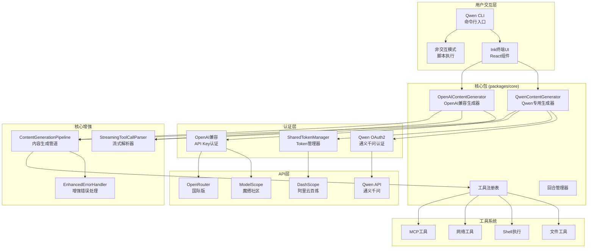

---

## 2. 核心工作流程

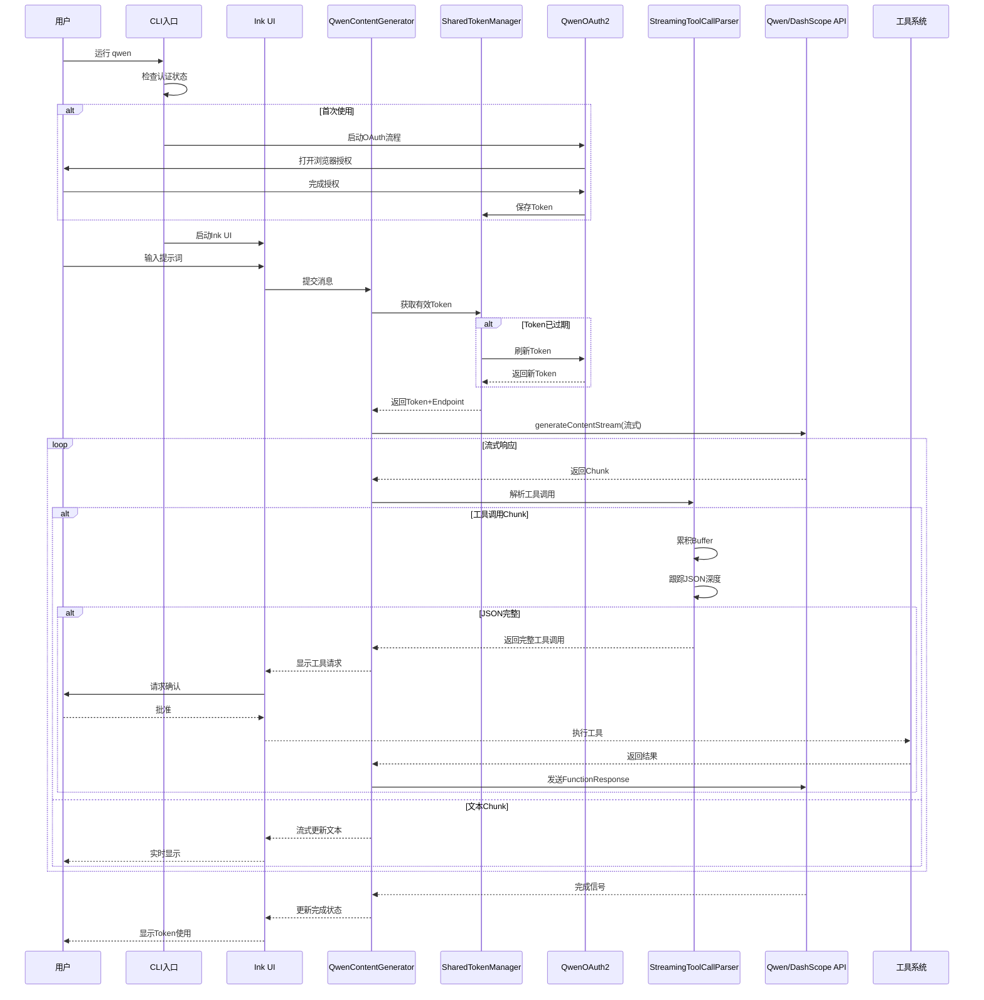

---

## 3. 关键差异：Qwen Code vs Gemini CLI

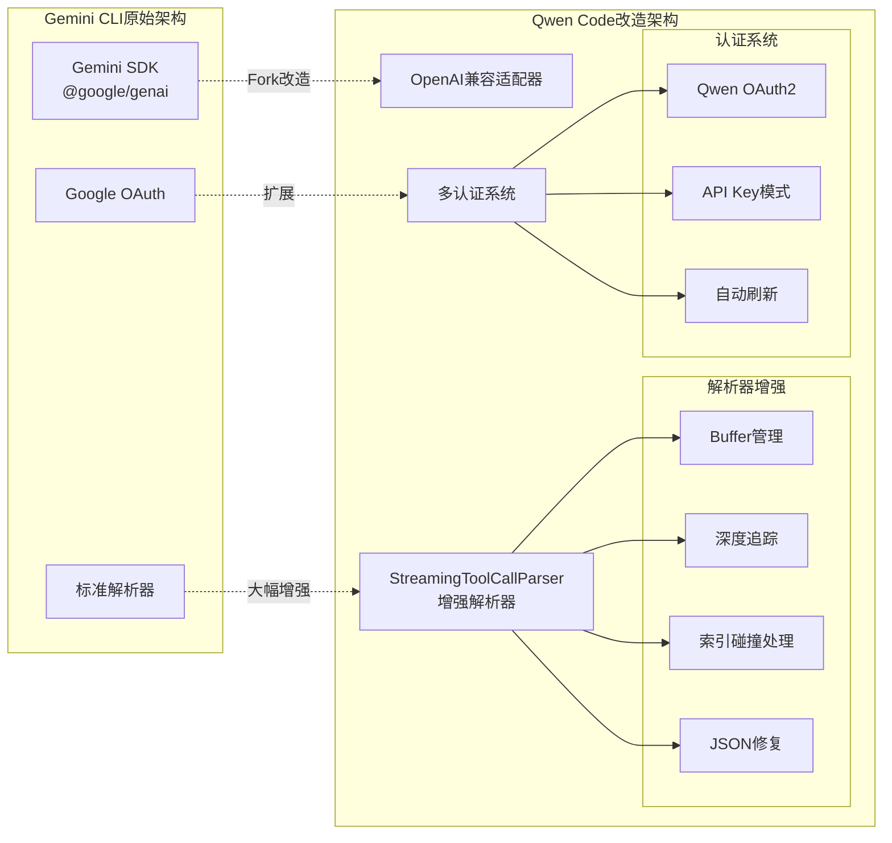

---

## 4. StreamingToolCallParser 核心创新

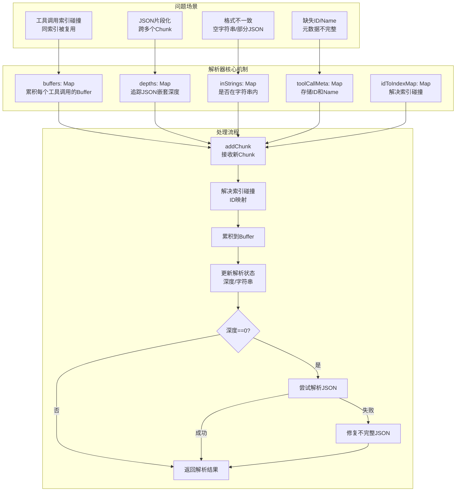

---

## 5. Qwen OAuth2 认证流程

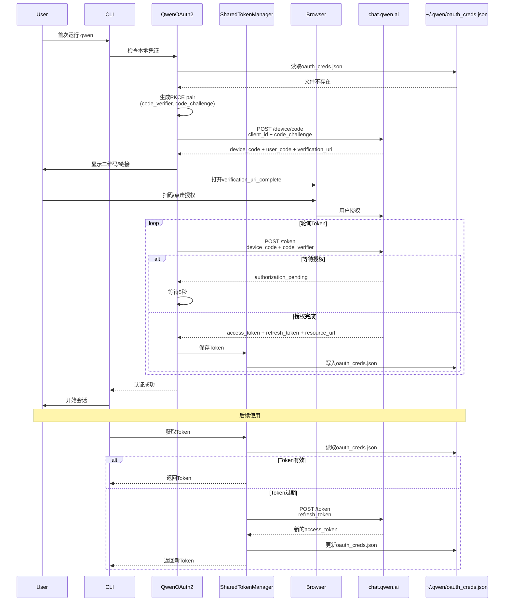

---

## 6. OpenAI兼容层架构

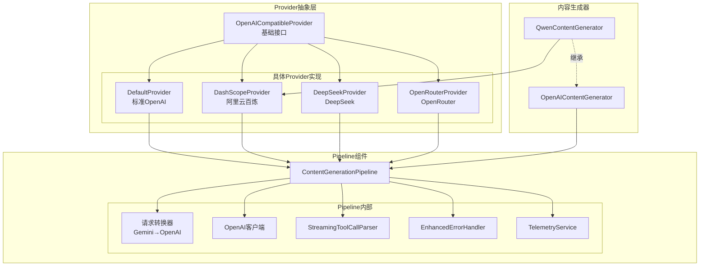

---

## 7. Vision Model自动切换机制

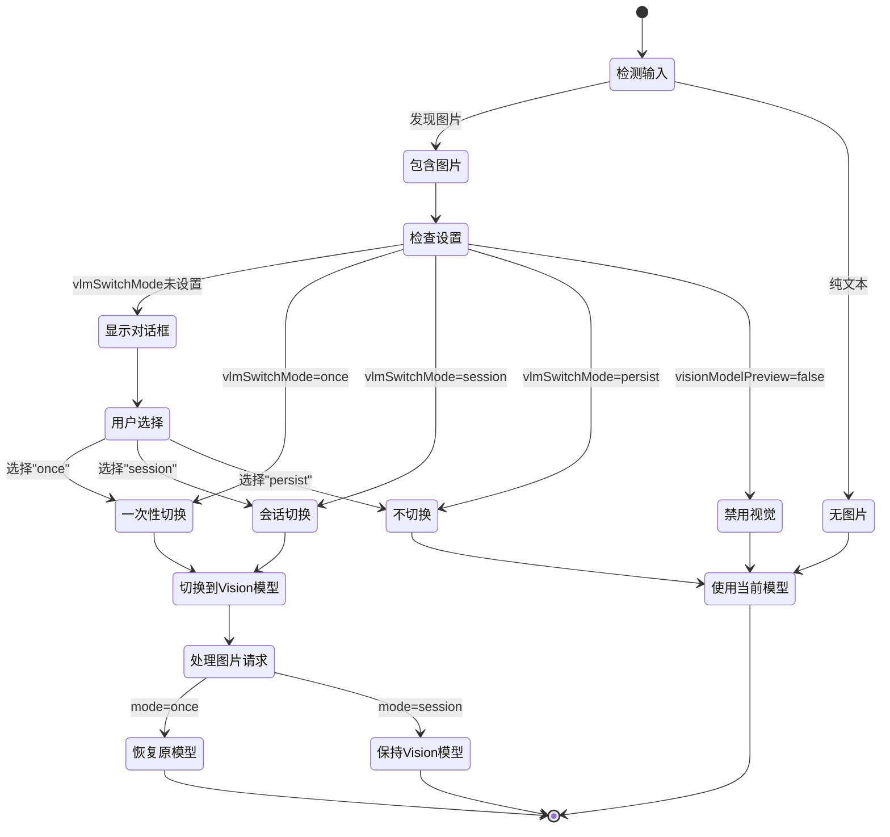

---

## 8. 会话Token管理与压缩

```mermaid
graph LR
    subgraph "Token监控"
        InputTokens[输入Token统计]
        OutputTokens[输出Token统计]
        HistoryTokens[历史Token统计]
        TotalCalc[总计计算]
    end
    
    subgraph "Session配置"
        SessionLimit[sessionTokenLimit<br/>会话Token上限]
        DefaultValue[默认值: 32000]
    end
    
    subgraph "达到上限处理"
        CheckLimit{超过限制?}
        
        subgraph "用户选项"
            Compress[/compress命令<br/>压缩历史]
            Clear[/clear命令<br/>清空历史]
            Stats[/stats命令<br/>查看统计]
        end
        
        subgraph "压缩机制"
            SelectHistory[选择压缩范围]
            CallSummarizer[调用Summarizer]
            ReplaceHistory[替换为摘要]
            RecalcTokens[重新计算Token]
        end
    end
    
    InputTokens --> TotalCalc
    OutputTokens --> TotalCalc
    HistoryTokens --> TotalCalc
    
    TotalCalc --> CheckLimit
    SessionLimit --> CheckLimit
    
    CheckLimit -->|是| Compress
    CheckLimit -->|是| Clear
    CheckLimit -->|是| Stats
    
    Compress --> SelectHistory
    SelectHistory --> CallSummarizer
    CallSummarizer --> ReplaceHistory
    ReplaceHistory --> RecalcTokens
    
    Clear --> TotalCalc
    RecalcTokens --> TotalCalc
```

---

## 9. 错误处理与重试机制

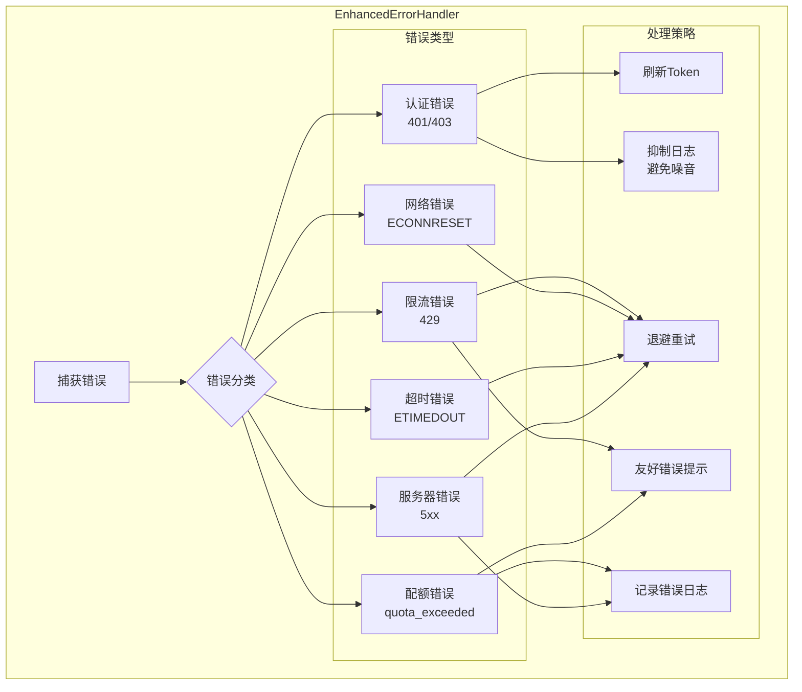

---

## 10. 包结构与模块依赖

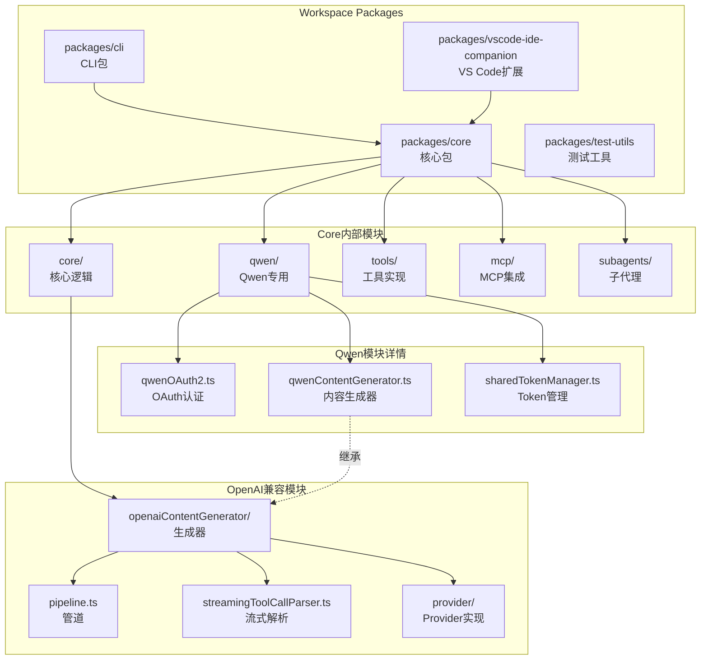

---

## 11. 技术栈与依赖对比

```mermaid
graph LR
    subgraph "Qwen Code技术栈"
        QwenLang[TypeScript/Node.js 20+]
        QwenUI[Ink + React]
        QwenAPI[OpenAI兼容API]
        QwenAuth[OAuth2 + PKCE]
        QwenParser[自定义StreamingParser]
        QwenTest[Vitest]
    end
    
    subgraph "Gemini CLI技术栈"
        GeminiLang[TypeScript/Node.js 20+]
        GeminiUI[Ink + React]
        GeminiAPI[@google/genai SDK]
        GeminiAuth[Google OAuth]
        GeminiParser[标准解析器]
        GeminiTest[Vitest]
    end
    
    subgraph "关键差异"
        APILayer[API层<br/>OpenAI兼容 vs Google SDK]
        ParserLayer[解析层<br/>增强解析 vs 标准解析]
        AuthLayer[认证层<br/>多Provider vs 单一Google]
    end
    
    QwenAPI -.主要差异.-> APILayer
    GeminiAPI -.主要差异.-> APILayer
    
    QwenParser -.核心创新.-> ParserLayer
    GeminiParser -.核心创新.-> ParserLayer
    
    QwenAuth -.扩展.-> AuthLayer
    GeminiAuth -.扩展.-> AuthLayer
```

---

## 12. 核心创新点总结

### 12.1 StreamingToolCallParser

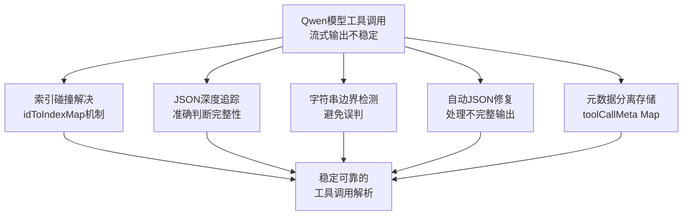

### 12.2 认证系统增强

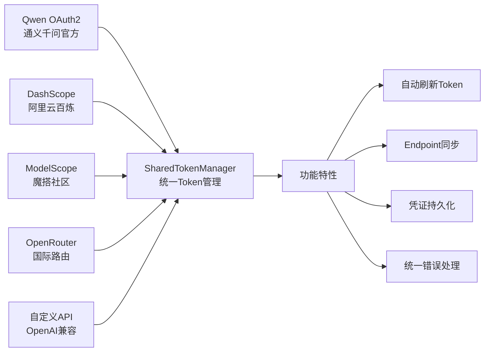

---

## 13. 数据流与状态管理

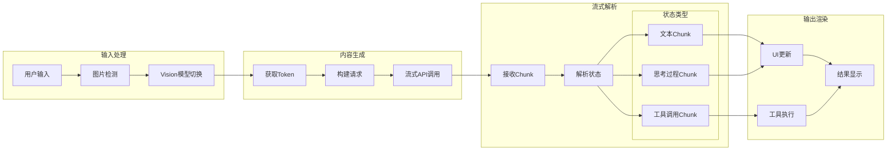

---

## 14. Benchmark性能

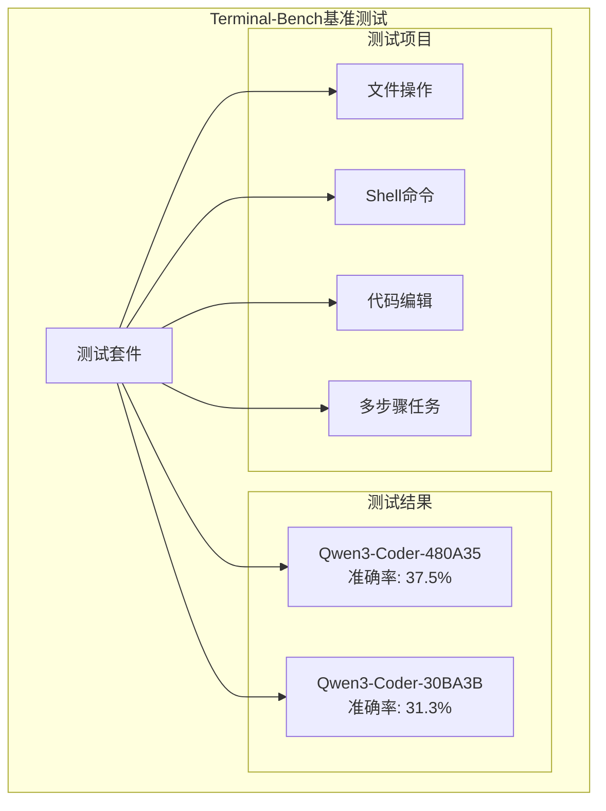

---

## 总结

### 核心特点

1. **基于Gemini CLI深度改造**: Fork自Google Gemini CLI，保留核心架构
2. **解析器层面大幅增强**: StreamingToolCallParser是核心创新
3. **多Provider认证支持**: 支持Qwen OAuth + 多个OpenAI兼容服务
4. **专为Qwen模型优化**: 处理Qwen3-Coder特有的输出特性
5. **Vision模型智能切换**: 自动检测图片并切换到视觉模型
6. **完善的Token管理**: SharedTokenManager统一管理所有认证

### 技术栈

- **语言**: TypeScript (Node.js >= 20)
- **UI框架**: Ink (React for Terminal)
- **API**: OpenAI Compatible API
- **认证**: OAuth2 + PKCE
- **测试**: Vitest
- **构建**: ESBuild

### 与Gemini CLI的主要差异

| 特性 | Qwen Code | Gemini CLI |
|------|-----------|------------|
| **API层** | OpenAI兼容 | Google GenAI SDK |
| **核心创新** | StreamingToolCallParser | 标准解析器 |
| **认证** | 多Provider (Qwen/DashScope/ModelScope) | Google OAuth |
| **模型支持** | Qwen3-Coder系列 | Gemini系列 |
| **解析器** | 索引碰撞处理+JSON修复 | 标准JSON解析 |
| **免费额度** | 2000请求/天 (Qwen OAuth) | 60请求/分钟 |

### 核心创新：StreamingToolCallParser

```
问题：Qwen模型工具调用输出不稳定
解决方案：
1. 索引碰撞处理 (idToIndexMap)
2. JSON深度追踪 (depths Map)
3. 字符串边界检测 (inStrings Map)
4. 自动JSON修复
5. Buffer累积机制
```

### 数据流总结

```
用户输入 → 图片检测 → Vision切换 → Token获取 → 请求构建
    ↓
流式API → Chunk接收 → StreamingParser → 解析完整工具调用
    ↓
工具执行 → 结果返回 → 继续流式 → 完成响应 → UI渲染
```

### 优势

- **免费额度高**: Qwen OAuth提供每天2000次请求
- **国内友好**: 支持阿里云百炼、魔搭社区
- **解析器强大**: 专门处理Qwen模型的输出特性
- **认证灵活**: 多种认证方式可选
- **开源透明**: 完全开源，Apache 2.0协议

Qwen Code通过在Gemini CLI基础上进行解析器层面的深度优化，为Qwen3-Coder模型提供了专业级的命令行AI助手体验。

