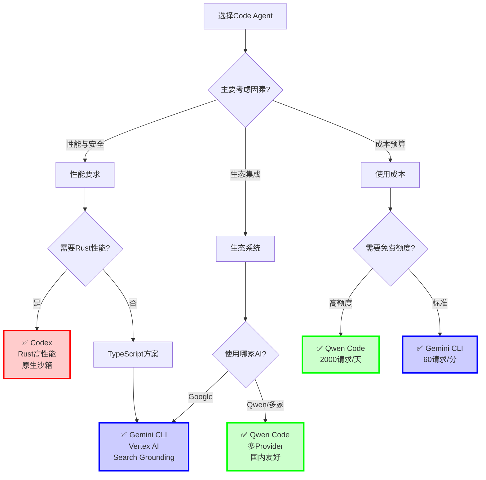
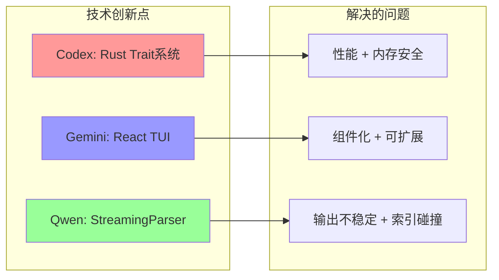

# 三大Code Agent精炼对比总结

## ⚡ 相同之处

### 架构设计模式
```
用户交互层 → 核心引擎 → AI API → 工具系统 → 沙箱执行
```

### 核心流程
```
输入 → Prompt构建 → 流式API调用 → 解析工具调用 → 请求审批 → 执行工具 → 反馈结果 → 继续对话
```

### 关键特性
- ✅ **会话持久化**：历史记录保存与恢复
- ✅ **工具审批机制**：写操作需用户确认
- ✅ **MCP协议支持**：扩展外部工具
- ✅ **上下文管理**：Token限制与压缩
- ✅ **沙箱隔离**：安全执行命令

---

## 🔥 关键差异对比表

| 维度 | **Codex (OpenAI)** | **Gemini CLI (Google)** | **Qwen Code (阿里云)** |
|------|-------------------|------------------------|---------------------|
| **语言栈** | Rust | TypeScript | TypeScript (Fork Gemini) |
| **UI框架** | ratatui (纯Rust) | Ink (React) | Ink (React) |
| **AI API** | OpenAI GPT | Google Gemini | OpenAI兼容(多Provider) |
| **认证** | ChatGPT OAuth / API Key | Google OAuth / Vertex AI | Qwen OAuth / 多API Key |
| **核心创新** | Rust高性能 + Trait工具系统 | React TUI + Google生态 | **StreamingToolCallParser** |
| **沙箱** | Seatbelt + Landlock | Docker/Podman | Docker/Podman |
| **免费额度** | Plus会员 | 60请求/分 | 2000请求/天 |

---

## 🚀 Agent处理机制详细对比

### 1. Codex (Rust架构)

```rust
// 核心特点：Trait-based抽象 + 类型安全
pub struct Codex {
    tx_sub: Sender<Submission>,    // 提交通道
    rx_event: Receiver<Event>,      // 事件通道
}
```

**Agent处理流程**:
```
1. Submission → Codex Queue
2. Turn创建 → ActiveTurn
3. ResponseEvent流 → 解析FunctionCall
4. ToolRouter → 匹配工具
5. Executor → Seatbelt/Landlock沙箱执行
6. 结果 → FunctionResponse → 下一轮
```

**优势**:
- ✅ 编译时类型安全
- ✅ 零成本抽象
- ✅ 原生沙箱支持

---

### 2. Gemini CLI (TypeScript)

```typescript
// 核心特点：React组件化 + Google SDK原生
class GeminiChat {
  history: Content[];
  tools: Tool[];
  
  async *sendMessageStream(message) {
    for await (const chunk of apiStream) {
      if (chunk.functionCall) {
        yield { type: 'tool_call', value: chunk.functionCall };
      }
    }
  }
}
```

**Agent处理流程**:
```
1. UI Input → GeminiChat
2. Turn → ContentGenerator
3. Gemini API流式 → 标准JSON解析
4. ToolRegistry → 工具查找
5. ConfirmationBus → UI确认
6. ShellExecutionService → 执行
7. Result → history → 下一轮
```

**优势**:
- ✅ Google生态集成
- ✅ React TUI组件化
- ✅ Search Grounding

---

### 3. Qwen Code (增强TypeScript)

```typescript
// 核心创新：StreamingToolCallParser
class StreamingToolCallParser {
  private buffers: Map<number, string>;        // 累积buffer
  private depths: Map<number, number>;         // JSON深度跟踪
  private idToIndexMap: Map<string, number>;   // 解决索引碰撞
  
  addChunk(index, chunk, id?, name?) {
    // 1. 解决索引碰撞
    let actualIndex = this.resolveIndexCollision(index, id);
    
    // 2. 累积到buffer
    this.buffers.set(actualIndex, buffer + chunk);
    
    // 3. 逐字符追踪JSON状态
    for (char of chunk) {
      if (char === '{') depth++;
      if (char === '}') depth--;
    }
    
    // 4. 完整时尝试解析 + 自动修复
    if (depth === 0) {
      return this.parseOrRepair(buffer);
    }
  }
}
```

**Agent处理流程**:
```
1. UI Input → QwenContentGenerator
2. SharedTokenManager → 获取Token+Endpoint
3. DashScope API流式 → StreamingToolCallParser
4. 解析器处理：
   ├─ 累积Buffer (处理片段化)
   ├─ 追踪深度 (判断完整性)
   ├─ 解决碰撞 (索引复用)
   └─ 修复JSON (不完整输出)
5. 完整工具调用 → 工具执行
6. Result → 下一轮
```

**独特优势**:
- ✅ 专门处理Qwen模型输出不稳定
- ✅ 多Provider支持
- ✅ 免费额度最高

---

## 🎨 Agent处理核心差异（流程图）

```mermaid
graph TB
    subgraph Codex["Codex - Rust类型安全"]
        C1[Turn强类型状态机]
        C2[ToolRouter Trait匹配]
        C3[Executor沙箱策略]
        C1 --> C2 --> C3
    end
    
    subgraph Gemini["Gemini CLI - 标准流程"]
        G1[Turn标准JSON解析]
        G2[ToolRegistry Map查找]
        G3[ShellService直接执行]
        G1 --> G2 --> G3
    end
    
    subgraph Qwen["Qwen Code - 增强解析"]
        Q1[Turn StreamingParser]
        Q2[Buffer累积 深度追踪]
        Q3[JSON修复 碰撞处理]
        Q4[工具执行]
        Q1 --> Q2 --> Q3 --> Q4
    end
    
    style Codex fill:#f9f,stroke:#333,stroke-width:2px
    style Gemini fill:#bbf,stroke:#333,stroke-width:2px
    style Qwen fill:#bfb,stroke:#333,stroke-width:2px
```



---

## 💡 核心差异总结（一句话）

| 项目 | Agent处理特点 |
|------|--------------|
| **Codex** | **Rust类型系统保证安全 + 原生沙箱隔离** |
| **Gemini CLI** | **React组件化UI + Google标准流程** |
| **Qwen Code** | **增强解析器处理模型输出不稳定 + 多Provider适配** |

---

## 🔑 选择建议（决策树）



---

## 📊 典型使用场景推荐

### 场景1: 高性能系统级开发
```
✅ 推荐: Codex
理由: Rust性能 + 编译时安全 + 原生沙箱
```

### 场景2: Google Cloud企业用户
```
✅ 推荐: Gemini CLI
理由: Vertex AI集成 + 企业级支持 + Search Grounding
```

### 场景3: 国内开发者 / 高频使用
```
✅ 推荐: Qwen Code
理由: 2000请求/天免费 + 国内API + Qwen模型优化
```

### 场景4: 多模型实验
```
✅ 推荐: Qwen Code
理由: 支持多Provider (DashScope/ModelScope/OpenRouter)
```

---

## 🎯 本质区别

| 项目 | 本质定位 |
|------|---------|
| **Codex** | 从零设计的**Rust原生实现**，强调性能和安全 |
| **Gemini CLI** | Google官方**TypeScript实现**，强调生态集成 |
| **Qwen Code** | **Fork + 解析器改造**，解决Qwen模型特殊问题 |

---

## 🔬 技术亮点对比



---

## 总结

### 相同点
- 架构模式一致 (分层 + 事件驱动)
- 都有工具审批机制
- 都支持MCP扩展
- 都实现会话管理

### 差异点
- **实现语言**: Rust vs TypeScript
- **核心创新**: 
  - Codex → 类型安全 + 沙箱
  - Gemini → React组件 + Google生态  
  - Qwen → StreamingParser + 多Provider
- **使用成本**: Codex(Plus) > Gemini(免费限额) < Qwen(高免费额度)

### 选择逻辑
```
性能优先 → Codex
Google用户 → Gemini CLI
国内/高频 → Qwen Code
```

