# 分析codex项目工作原理
_Exported on 2025/10/3 at GMT+8 22:40:22 from Cursor (1.7.28)_

---

**User**

@codex/ 分析一下codex项目的代码，用专业的图表（mermaid格式）直接画出其工作原理

---

**Cursor**

我将分析codex项目的代码结构和工作原理，然后用Mermaid图表呈现。让我先深入了解项目的架构。

让我继续深入了解关键组件之间的交互流程。

现在我已经充分理解了Codex项目的架构。让我创建专业的Mermaid图表来展示其工作原理。

```markdown
# Codex 项目架构分析

## 项目概述

Codex 是 OpenAI 开发的本地运行的代码智能助手CLI工具，采用 Rust(后端核心) + TypeScript(CLI包装/SDK) 的混合架构。

---

## 1. 整体架构图

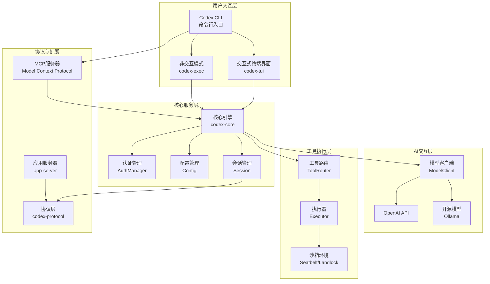
```mermaid
graph TB
    subgraph "用户交互层"
        CLI[Codex CLI<br/>命令行入口]
        TUI[交互式终端界面<br/>codex-tui]
        EXEC[非交互模式<br/>codex-exec]
    end
    
    subgraph "核心服务层"
        CORE[核心引擎<br/>codex-core]
        AUTH[认证管理<br/>AuthManager]
        CONFIG[配置管理<br/>Config]
        SESSION[会话管理<br/>Session]
    end
    
    subgraph "AI交互层"
        CLIENT[模型客户端<br/>ModelClient]
        OPENAI[OpenAI API]
        OSS[开源模型<br/>Ollama]
    end
    
    subgraph "工具执行层"
        EXECUTOR[执行器<br/>Executor]
        TOOLS[工具路由<br/>ToolRouter]
        SANDBOX[沙箱环境<br/>Seatbelt/Landlock]
    end
    
    subgraph "协议与扩展"
        MCP[MCP服务器<br/>Model Context Protocol]
        PROTOCOL[协议层<br/>codex-protocol]
        APPSERVER[应用服务器<br/>app-server]
    end
    
    CLI --> TUI
    CLI --> EXEC
    CLI --> MCP
    
    TUI --> CORE
    EXEC --> CORE
    MCP --> CORE
    
    CORE --> AUTH
    CORE --> CONFIG
    CORE --> SESSION
    CORE --> CLIENT
    CORE --> TOOLS
    
    CLIENT --> OPENAI
    CLIENT --> OSS
    
    TOOLS --> EXECUTOR
    EXECUTOR --> SANDBOX
    
    SESSION --> PROTOCOL
    APPSERVER --> PROTOCOL
```

---

## 2. 核心工作流程

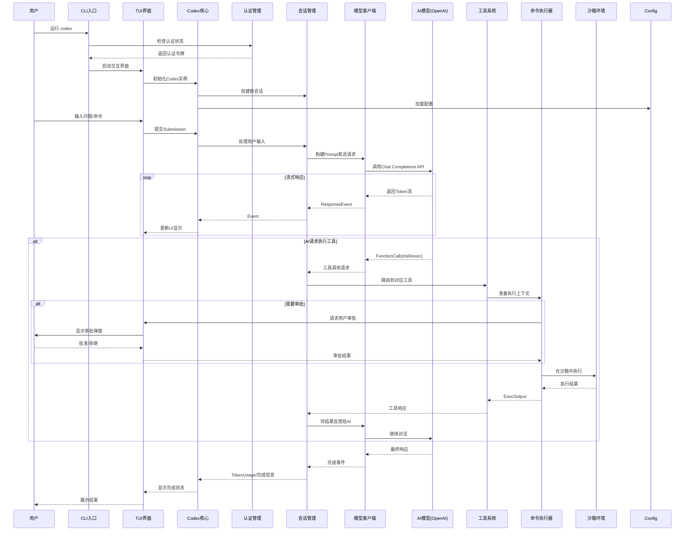
```mermaid
sequenceDiagram
    participant User as 用户
    participant CLI as CLI入口
    participant TUI as TUI界面
    participant Core as Codex核心
    participant Auth as 认证管理
    participant Session as 会话管理
    participant Client as 模型客户端
    participant AI as AI模型(OpenAI)
    participant Tools as 工具系统
    participant Executor as 命令执行器
    participant Sandbox as 沙箱环境
    
    User->>CLI: 运行 codex
    CLI->>Auth: 检查认证状态
    Auth-->>CLI: 返回认证令牌
    
    CLI->>TUI: 启动交互界面
    TUI->>Core: 初始化Codex实例
    Core->>Session: 创建新会话
    Core->>Config: 加载配置
    
    User->>TUI: 输入问题/命令
    TUI->>Core: 提交Submission
    Core->>Session: 处理用户输入
    
    Session->>Client: 构建Prompt发送请求
    Client->>AI: 调用Chat Completions API
    
    loop 流式响应
        AI-->>Client: 返回Token流
        Client-->>Session: ResponseEvent
        Session-->>Core: Event
        Core-->>TUI: 更新UI显示
    end
    
    alt AI请求执行工具
        AI-->>Client: FunctionCall(shell/exec)
        Client-->>Session: 工具调用请求
        Session->>Tools: 路由到对应工具
        
        Tools->>Executor: 准备执行上下文
        
        alt 需要审批
            Executor->>TUI: 请求用户审批
            TUI->>User: 显示审批弹窗
            User-->>TUI: 批准/拒绝
            TUI-->>Executor: 审批结果
        end
        
        Executor->>Sandbox: 在沙箱中执行
        Sandbox-->>Executor: 执行结果
        Executor-->>Tools: ExecOutput
        Tools-->>Session: 工具响应
        Session->>Client: 将结果反馈给AI
        Client->>AI: 继续对话
    end
    
    AI-->>Client: 最终响应
    Client-->>Session: 完成事件
    Session-->>Core: TokenUsage/完成信息
    Core-->>TUI: 显示完成状态
    TUI-->>User: 展示结果
```

---

## 3. Codex核心引擎架构

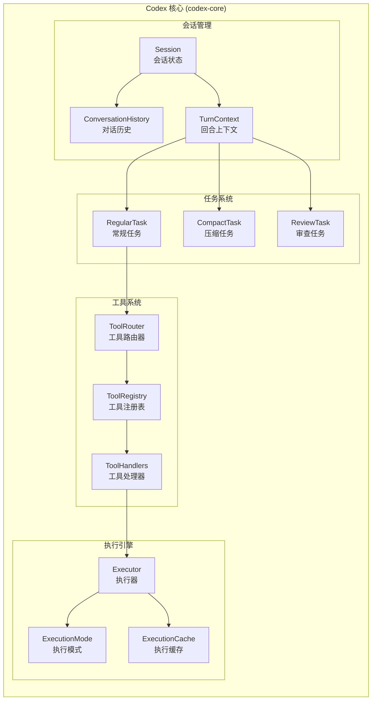
```mermaid
graph LR
    subgraph "Codex 核心 (codex-core)"
        subgraph "会话管理"
            Session[Session<br/>会话状态]
            History[ConversationHistory<br/>对话历史]
            TurnContext[TurnContext<br/>回合上下文]
        end
        
        subgraph "任务系统"
            RegularTask[RegularTask<br/>常规任务]
            CompactTask[CompactTask<br/>压缩任务]
            ReviewTask[ReviewTask<br/>审查任务]
        end
        
        subgraph "工具系统"
            ToolRouter[ToolRouter<br/>工具路由器]
            ToolRegistry[ToolRegistry<br/>工具注册表]
            ToolHandlers[ToolHandlers<br/>工具处理器]
        end
        
        subgraph "执行引擎"
            Executor[Executor<br/>执行器]
            ExecMode[ExecutionMode<br/>执行模式]
            ExecCache[ExecutionCache<br/>执行缓存]
        end
    end
    
    Session --> History
    Session --> TurnContext
    
    TurnContext --> RegularTask
    TurnContext --> CompactTask
    TurnContext --> ReviewTask
    
    RegularTask --> ToolRouter
    ToolRouter --> ToolRegistry
    ToolRegistry --> ToolHandlers
    
    ToolHandlers --> Executor
    Executor --> ExecMode
    Executor --> ExecCache
```

---

## 4. TUI交互界面架构

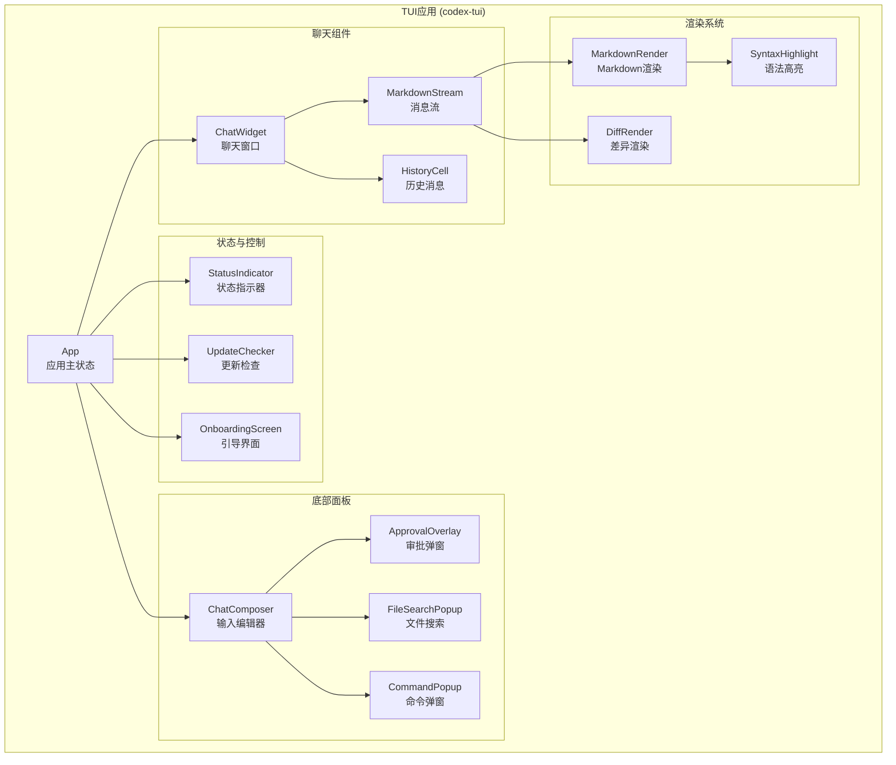
```mermaid
graph TB
    subgraph "TUI应用 (codex-tui)"
        App[App<br/>应用主状态]
        
        subgraph "聊天组件"
            ChatWidget[ChatWidget<br/>聊天窗口]
            MessageStream[MarkdownStream<br/>消息流]
            HistoryCell[HistoryCell<br/>历史消息]
        end
        
        subgraph "底部面板"
            Composer[ChatComposer<br/>输入编辑器]
            ApprovalOverlay[ApprovalOverlay<br/>审批弹窗]
            FileSearch[FileSearchPopup<br/>文件搜索]
            CommandPopup[CommandPopup<br/>命令弹窗]
        end
        
        subgraph "状态与控制"
            Status[StatusIndicator<br/>状态指示器]
            Updates[UpdateChecker<br/>更新检查]
            Onboarding[OnboardingScreen<br/>引导界面]
        end
        
        subgraph "渲染系统"
            Markdown[MarkdownRender<br/>Markdown渲染]
            DiffRender[DiffRender<br/>差异渲染]
            Highlight[SyntaxHighlight<br/>语法高亮]
        end
    end
    
    App --> ChatWidget
    App --> Composer
    App --> Status
    
    ChatWidget --> MessageStream
    ChatWidget --> HistoryCell
    
    Composer --> ApprovalOverlay
    Composer --> FileSearch
    Composer --> CommandPopup
    
    MessageStream --> Markdown
    MessageStream --> DiffRender
    Markdown --> Highlight
    
    App --> Updates
    App --> Onboarding
```

---

## 5. 认证与配置流程

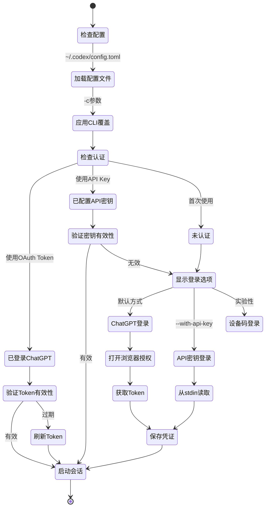
```mermaid
stateDiagram-v2
    [*] --> 检查配置
    
    检查配置 --> 加载配置文件: ~/.codex/config.toml
    加载配置文件 --> 应用CLI覆盖: -c参数
    应用CLI覆盖 --> 检查认证
    
    检查认证 --> 已登录ChatGPT: 使用OAuth Token
    检查认证 --> 已配置API密钥: 使用API Key
    检查认证 --> 未认证: 首次使用
    
    未认证 --> 显示登录选项
    显示登录选项 --> ChatGPT登录: 默认方式
    显示登录选项 --> API密钥登录: --with-api-key
    显示登录选项 --> 设备码登录: 实验性
    
    ChatGPT登录 --> 打开浏览器授权
    打开浏览器授权 --> 获取Token
    获取Token --> 保存凭证
    
    API密钥登录 --> 从stdin读取
    从stdin读取 --> 保存凭证
    
    已登录ChatGPT --> 验证Token有效性
    已配置API密钥 --> 验证密钥有效性
    
    验证Token有效性 --> 启动会话: 有效
    验证Token有效性 --> 刷新Token: 过期
    验证密钥有效性 --> 启动会话: 有效
    验证密钥有效性 --> 显示登录选项: 无效
    
    刷新Token --> 启动会话
    保存凭证 --> 启动会话
    
    启动会话 --> [*]
```

---

## 6. 工具执行与沙箱隔离

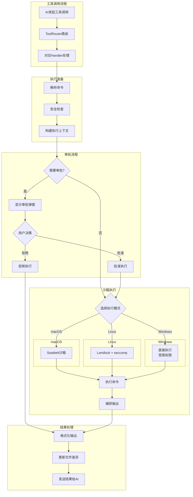
```mermaid
graph TD
    subgraph "工具调用流程"
        ToolCall[AI发起工具调用]
        Router[ToolRouter路由]
        Handler[对应Handler处理]
    end
    
    subgraph "执行准备"
        ParseCmd[解析命令]
        SafetyCheck[安全检查]
        BuildContext[构建执行上下文]
    end
    
    subgraph "审批流程"
        NeedApproval{需要审批?}
        ShowApproval[显示审批弹窗]
        UserDecision{用户决策}
        Approved[批准执行]
        Rejected[拒绝执行]
    end
    
    subgraph "沙箱执行"
        SelectMode{选择执行模式}
        
        subgraph "macOS"
            Seatbelt[Seatbelt沙箱]
        end
        
        subgraph "Linux"
            Landlock[Landlock + seccomp]
        end
        
        subgraph "Windows"
            WindowsExec[直接执行<br/>受限权限]
        end
        
        Execute[执行命令]
        CaptureOutput[捕获输出]
    end
    
    subgraph "结果处理"
        FormatOutput[格式化输出]
        UpdateDiff[更新文件差异]
        SendToAI[发送结果给AI]
    end
    
    ToolCall --> Router
    Router --> Handler
    Handler --> ParseCmd
    ParseCmd --> SafetyCheck
    SafetyCheck --> BuildContext
    
    BuildContext --> NeedApproval
    NeedApproval -->|是| ShowApproval
    NeedApproval -->|否| SelectMode
    
    ShowApproval --> UserDecision
    UserDecision -->|批准| Approved
    UserDecision -->|拒绝| Rejected
    
    Approved --> SelectMode
    Rejected --> FormatOutput
    
    SelectMode -->|macOS| Seatbelt
    SelectMode -->|Linux| Landlock
    SelectMode -->|Windows| WindowsExec
    
    Seatbelt --> Execute
    Landlock --> Execute
    WindowsExec --> Execute
    
    Execute --> CaptureOutput
    CaptureOutput --> FormatOutput
    FormatOutput --> UpdateDiff
    UpdateDiff --> SendToAI
```

---

## 7. MCP (Model Context Protocol) 架构

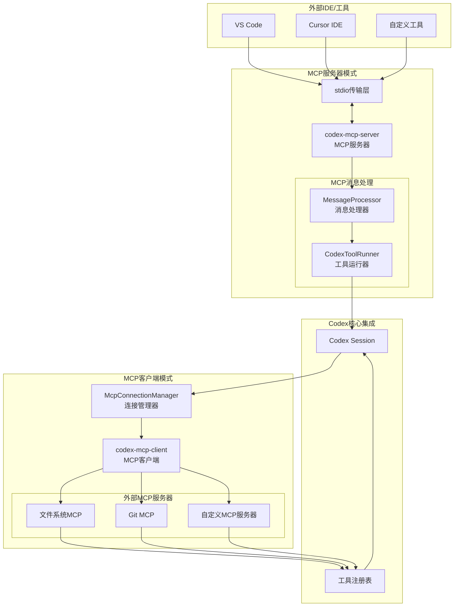
```mermaid
graph TB
    subgraph "MCP服务器模式"
        MCPServer[codex-mcp-server<br/>MCP服务器]
        StdIO[stdio传输层]
        
        subgraph "MCP消息处理"
            MessageProc[MessageProcessor<br/>消息处理器]
            ToolRunner[CodexToolRunner<br/>工具运行器]
        end
    end
    
    subgraph "MCP客户端模式"
        MCPClient[codex-mcp-client<br/>MCP客户端]
        ConnMgr[McpConnectionManager<br/>连接管理器]
        
        subgraph "外部MCP服务器"
            External1[文件系统MCP]
            External2[Git MCP]
            External3[自定义MCP服务器]
        end
    end
    
    subgraph "Codex核心集成"
        CoreSession[Codex Session]
        ToolRegistry[工具注册表]
    end
    
    subgraph "外部IDE/工具"
        VSCode[VS Code]
        Cursor[Cursor IDE]
        CustomTool[自定义工具]
    end
    
    VSCode --> StdIO
    Cursor --> StdIO
    CustomTool --> StdIO
    
    StdIO <--> MCPServer
    MCPServer --> MessageProc
    MessageProc --> ToolRunner
    ToolRunner --> CoreSession
    
    CoreSession --> ConnMgr
    ConnMgr --> MCPClient
    
    MCPClient --> External1
    MCPClient --> External2
    MCPClient --> External3
    
    External1 --> ToolRegistry
    External2 --> ToolRegistry
    External3 --> ToolRegistry
    
    ToolRegistry --> CoreSession
```

---

## 8. 数据流与事件系统

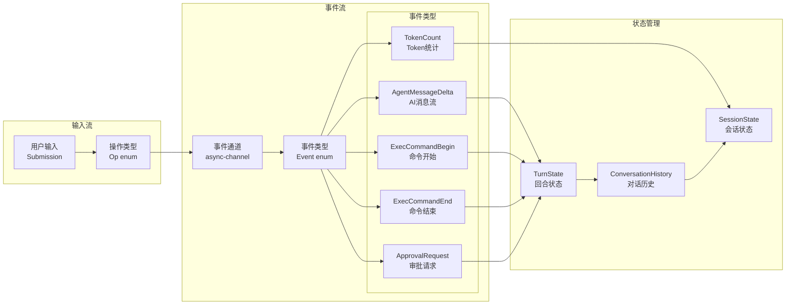
```mermaid
graph LR
    subgraph "输入流"
        UserInput[用户输入<br/>Submission]
        OpTypes[操作类型<br/>Op enum]
    end
    
    subgraph "事件流"
        EventChannel[事件通道<br/>async-channel]
        EventTypes[事件类型<br/>Event enum]
        
        subgraph "事件类型"
            AgentDelta[AgentMessageDelta<br/>AI消息流]
            ExecBegin[ExecCommandBegin<br/>命令开始]
            ExecEnd[ExecCommandEnd<br/>命令结束]
            ApprovalReq[ApprovalRequest<br/>审批请求]
            TokenCount[TokenCount<br/>Token统计]
        end
    end
    
    subgraph "状态管理"
        SessionState[SessionState<br/>会话状态]
        TurnState[TurnState<br/>回合状态]
        History[ConversationHistory<br/>对话历史]
    end
    
    UserInput --> OpTypes
    OpTypes --> EventChannel
    
    EventChannel --> EventTypes
    
    EventTypes --> AgentDelta
    EventTypes --> ExecBegin
    EventTypes --> ExecEnd
    EventTypes --> ApprovalReq
    EventTypes --> TokenCount
    
    AgentDelta --> TurnState
    ExecBegin --> TurnState
    ExecEnd --> TurnState
    ApprovalReq --> TurnState
    TokenCount --> SessionState
    
    TurnState --> History
    History --> SessionState
```

---

## 9. 项目模块关系

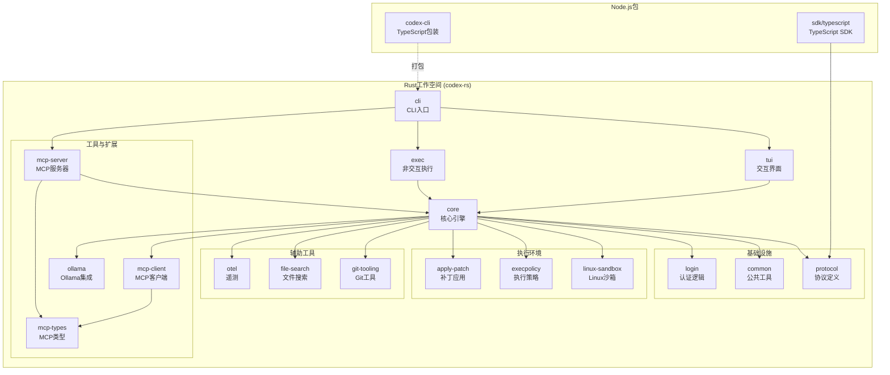
```mermaid
graph TB
    subgraph "Rust工作空间 (codex-rs)"
        CLI_MOD[cli<br/>CLI入口]
        CORE_MOD[core<br/>核心引擎]
        TUI_MOD[tui<br/>交互界面]
        EXEC_MOD[exec<br/>非交互执行]
        
        subgraph "基础设施"
            PROTOCOL_MOD[protocol<br/>协议定义]
            COMMON_MOD[common<br/>公共工具]
            AUTH_MOD[login<br/>认证逻辑]
        end
        
        subgraph "工具与扩展"
            MCP_SERVER_MOD[mcp-server<br/>MCP服务器]
            MCP_CLIENT_MOD[mcp-client<br/>MCP客户端]
            MCP_TYPES_MOD[mcp-types<br/>MCP类型]
            OLLAMA_MOD[ollama<br/>Ollama集成]
        end
        
        subgraph "执行环境"
            SANDBOX_LINUX[linux-sandbox<br/>Linux沙箱]
            EXECPOLICY[execpolicy<br/>执行策略]
            APPLY_PATCH[apply-patch<br/>补丁应用]
        end
        
        subgraph "辅助工具"
            GIT_TOOLS[git-tooling<br/>Git工具]
            FILE_SEARCH[file-search<br/>文件搜索]
            OTEL[otel<br/>遥测]
        end
    end
    
    subgraph "Node.js包"
        CLI_TS[codex-cli<br/>TypeScript包装]
        SDK_TS[sdk/typescript<br/>TypeScript SDK]
    end
    
    CLI_MOD --> TUI_MOD
    CLI_MOD --> EXEC_MOD
    CLI_MOD --> MCP_SERVER_MOD
    
    TUI_MOD --> CORE_MOD
    EXEC_MOD --> CORE_MOD
    MCP_SERVER_MOD --> CORE_MOD
    
    CORE_MOD --> PROTOCOL_MOD
    CORE_MOD --> COMMON_MOD
    CORE_MOD --> AUTH_MOD
    CORE_MOD --> MCP_CLIENT_MOD
    CORE_MOD --> OLLAMA_MOD
    CORE_MOD --> SANDBOX_LINUX
    CORE_MOD --> EXECPOLICY
    CORE_MOD --> APPLY_PATCH
    CORE_MOD --> GIT_TOOLS
    CORE_MOD --> FILE_SEARCH
    CORE_MOD --> OTEL
    
    MCP_CLIENT_MOD --> MCP_TYPES_MOD
    MCP_SERVER_MOD --> MCP_TYPES_MOD
    
    CLI_TS -.->|打包| CLI_MOD
    SDK_TS --> PROTOCOL_MOD
```

---

## 10. 关键特性实现

### 10.1 会话持久化与恢复

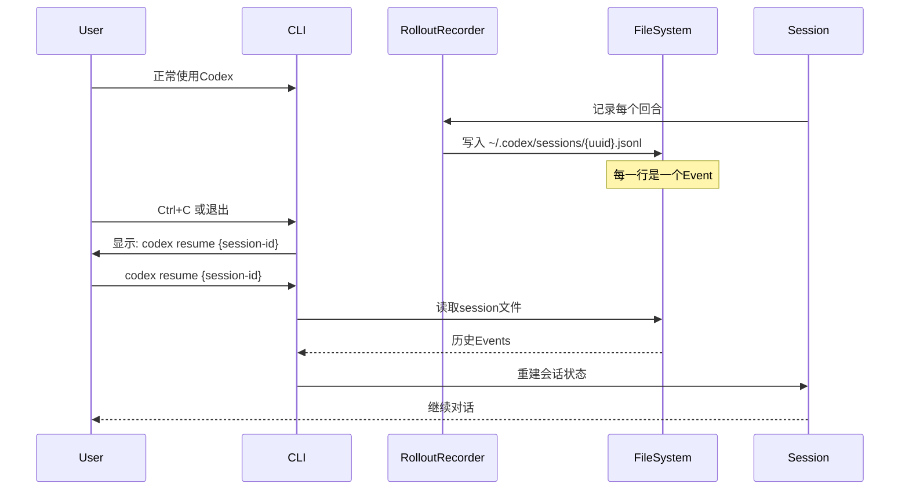
```mermaid
sequenceDiagram
    participant User
    participant CLI
    participant RolloutRecorder
    participant FileSystem
    participant Session
    
    User->>CLI: 正常使用Codex
    Session->>RolloutRecorder: 记录每个回合
    RolloutRecorder->>FileSystem: 写入 ~/.codex/sessions/{uuid}.jsonl
    
    Note over FileSystem: 每一行是一个Event
    
    User->>CLI: Ctrl+C 或退出
    CLI->>User: 显示: codex resume {session-id}
    
    User->>CLI: codex resume {session-id}
    CLI->>FileSystem: 读取session文件
    FileSystem-->>CLI: 历史Events
    CLI->>Session: 重建会话状态
    Session-->>User: 继续对话
```

### 10.2 文件差异追踪

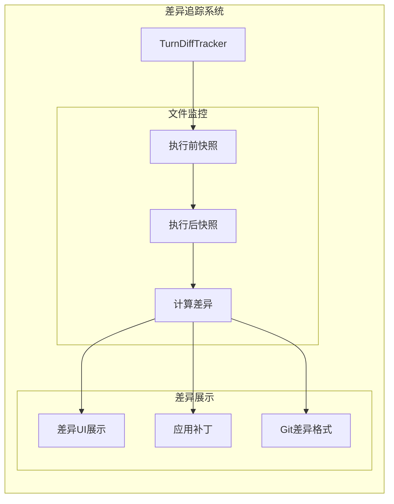
```mermaid
graph LR
    subgraph "差异追踪系统"
        TurnDiff[TurnDiffTracker]
        
        subgraph "文件监控"
            PreExec[执行前快照]
            PostExec[执行后快照]
            DiffCalc[计算差异]
        end
        
        subgraph "差异展示"
            DiffUI[差异UI展示]
            ApplyPatch[应用补丁]
            GitDiff[Git差异格式]
        end
    end
    
    TurnDiff --> PreExec
    PreExec --> PostExec
    PostExec --> DiffCalc
    
    DiffCalc --> DiffUI
    DiffCalc --> ApplyPatch
    DiffCalc --> GitDiff
```

---

## 总结

### 架构亮点

1. **分层清晰**: CLI → TUI/EXEC → Core → Tools/Executor → Sandbox
2. **异步驱动**: 全面使用 Tokio 异步运行时，事件驱动架构
3. **类型安全**: Rust + TypeScript，强类型系统保证安全性
4. **沙箱隔离**: 多平台沙箱支持（Seatbelt/Landlock/seccomp）
5. **可扩展**: MCP协议支持，工具系统插件化
6. **用户友好**: TUI交互式界面，审批机制，会话恢复

### 核心技术栈

- **语言**: Rust (核心) + TypeScript (CLI/SDK)
- **UI框架**: ratatui (终端UI)
- **异步运行时**: Tokio
- **序列化**: serde + serde_json
- **协议**: JSON-RPC (MCP), SSE (流式响应)
- **沙箱**: Seatbelt (macOS), Landlock + seccomp (Linux)

### 数据流向

```
用户输入 → Submission → Codex核心 → ModelClient → AI API
                ↓                            ↓
            Event流 ← ResponseEvent ← 流式响应
                ↓
            TUI更新 ← 工具执行 ← FunctionCall
```

```

完美！我已经为您创建了一份全面的Codex项目架构分析文档，包含10个专业的Mermaid图表：

## 📊 图表概览

1. **整体架构图** - 展示四大层次：用户交互层、核心服务层、AI交互层、工具执行层
2. **核心工作流程** - 完整的序列图，展示从用户输入到AI响应的全流程
3. **Codex核心引擎架构** - 核心模块的内部结构
4. **TUI交互界面架构** - 终端UI组件的组织方式
5. **认证与配置流程** - 状态机图展示登录和配置加载流程
6. **工具执行与沙箱隔离** - 详细展示命令执行和多平台沙箱机制
7. **MCP架构** - Model Context Protocol的服务器/客户端模式
8. **数据流与事件系统** - 异步事件驱动的数据流向
9. **项目模块关系** - Rust工作空间和Node.js包的依赖关系
10. **关键特性实现** - 会话持久化和文件差异追踪的实现细节

## 🎯 核心发现

**架构特点**:
- **四层架构**: 用户交互 → 核心服务 → AI交互 → 工具执行
- **异步事件驱动**: 使用Tokio和async-channel实现高效的异步处理
- **沙箱隔离**: 支持macOS(Seatbelt)、Linux(Landlock+seccomp)、Windows多平台
- **MCP扩展**: 支持Model Context Protocol，可与外部工具集成
- **会话持久化**: JSONL格式记录每个回合，支持恢复对话

**技术栈**:
- Rust (核心引擎) + TypeScript (CLI包装)
- ratatui (终端UI) + Tokio (异步运行时)
- OpenAI API + Ollama (开源模型支持)

所有图表都使用标准Mermaid语法，可以在支持Mermaid的Markdown查看器中直接渲染！

---

**User**

调用md to pdf的MCP把刚才的md文件转化为pdf格式

---

**Cursor**

好的，我将使用MCP工具将刚才创建的Markdown文件转换为PDF格式。


看来MCP工具在处理Mermaid图表时遇到了问题。让我先检查一下文件路径，然后尝试另一种方式：

文件确实存在。让我尝试使用相对路径再次调用MCP转换工具：

看起来MCP工具在提取Mermaid图表并创建临时文件时出现了问题。让我检查一下`.out`目录是否存在：

---

**User**

继续

---

**Cursor**

我看到`.out\diagram_1.mmd`文件已经被创建了。让我检查一下这个文件并重新尝试转换：

好的，文件已经被创建了。问题可能是路径中的引号导致的。让我尝试手动运行Mermaid CLI命令来生成SVG：

太好了！Mermaid命令成功了。看来问题是MCP工具在Windows路径处理上有问题。让我尝试一个替代方案 - 使用Node.js直接调用MCP工具或者使用其他PDF转换方式。让我先检查是否有其他可用的转换工具：

---

**User**

继续

---

**Cursor**

好的，我看到SVG文件已经生成了。现在让我尝试使用不同的方法来转换PDF。让我创建一个简单的Node.js脚本来处理这个转换：

```javascript
const fs = require('fs');
const path = require('path');
const { execSync } = require('child_process');

const inputFile = 'codex_architecture_analysis.md';
const outputFile = 'codex_architecture_analysis.pdf';

console.log('开始转换Markdown到PDF...');

try {
  // 使用npx运行md-to-pdf
  const command = `npx -y md-to-pdf "${inputFile}" --pdf-options "{ \\"format\\": \\"A4\\", \\"margin\\": \\"20mm\\" }"`;
  console.log('执行命令:', command);
  
  execSync(command, { 
    stdio: 'inherit',
    shell: 'powershell.exe'
  });
  
  console.log(`✓ PDF文件已生成: ${outputFile}`);
} catch (error) {
  console.error('转换失败:', error.message);
  process.exit(1);
}

```

---

**User**

继续分析gemini-cli项目的技术原理，同样输出一个md文件

---

**Cursor**

好的，我现在来分析gemini-cli项目的技术原理。让我先深入了解这个项目的结构和核心实现。

继续深入了解核心组件：

现在我已经充分了解了gemini-cli的架构，让我创建详细的技术分析文档：

```markdown
# Gemini CLI 项目架构分析

## 项目概述

Gemini CLI 是 Google 开发的开源 AI 代码助手命令行工具，完全基于 **TypeScript + Node.js** 构建，提供强大的终端AI交互体验。与 Codex 的 Rust 架构不同，Gemini CLI 采用纯 JavaScript 生态系统。

---

## 1. 整体架构图

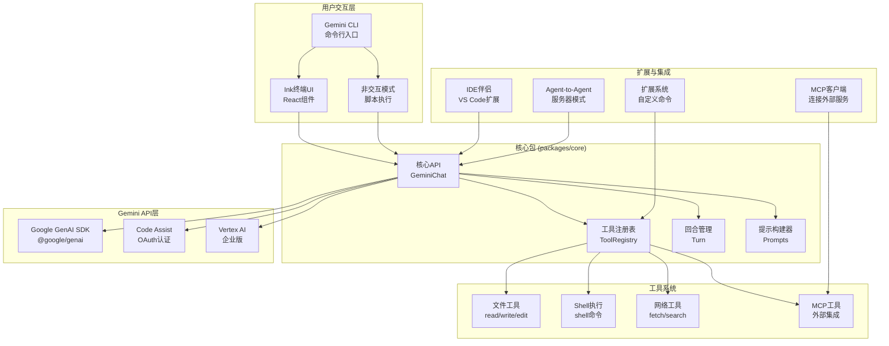
```mermaid
graph TB
    subgraph "用户交互层"
        CLI[Gemini CLI<br/>命令行入口]
        InkUI[Ink终端UI<br/>React组件]
        NonInteractive[非交互模式<br/>脚本执行]
    end
    
    subgraph "核心包 (packages/core)"
        CoreAPI[核心API<br/>GeminiChat]
        ToolRegistry[工具注册表<br/>ToolRegistry]
        TurnManager[回合管理<br/>Turn]
        PromptBuilder[提示构建器<br/>Prompts]
    end
    
    subgraph "Gemini API层"
        GenAI[Google GenAI SDK<br/>@google/genai]
        CodeAssist[Code Assist<br/>OAuth认证]
        VertexAI[Vertex AI<br/>企业版]
    end
    
    subgraph "工具系统"
        FileTools[文件工具<br/>read/write/edit]
        ShellTool[Shell执行<br/>shell命令]
        WebTools[网络工具<br/>fetch/search]
        MCPTools[MCP工具<br/>外部集成]
    end
    
    subgraph "扩展与集成"
        MCPClient[MCP客户端<br/>连接外部服务]
        Extensions[扩展系统<br/>自定义命令]
        IDECompanion[IDE伴侣<br/>VS Code扩展]
        A2AServer[Agent-to-Agent<br/>服务器模式]
    end
    
    CLI --> InkUI
    CLI --> NonInteractive
    
    InkUI --> CoreAPI
    NonInteractive --> CoreAPI
    
    CoreAPI --> GenAI
    CoreAPI --> CodeAssist
    CoreAPI --> VertexAI
    
    CoreAPI --> TurnManager
    CoreAPI --> ToolRegistry
    CoreAPI --> PromptBuilder
    
    ToolRegistry --> FileTools
    ToolRegistry --> ShellTool
    ToolRegistry --> WebTools
    ToolRegistry --> MCPTools
    
    MCPClient --> MCPTools
    Extensions --> ToolRegistry
    
    IDECompanion --> CoreAPI
    A2AServer --> CoreAPI
```

---

## 2. 核心工作流程

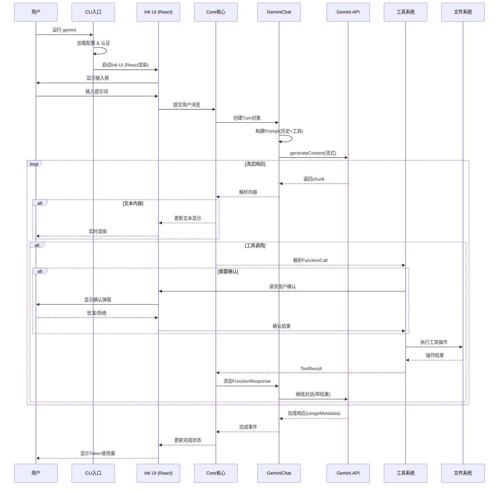
```mermaid
sequenceDiagram
    participant User as 用户
    participant CLI as CLI入口
    participant UI as Ink UI (React)
    participant Core as Core核心
    participant Chat as GeminiChat
    participant API as Gemini API
    participant Tools as 工具系统
    participant FS as 文件系统
    
    User->>CLI: 运行 gemini
    CLI->>CLI: 加载配置 & 认证
    CLI->>UI: 启动Ink UI (React渲染)
    
    UI->>User: 显示输入框
    User->>UI: 输入提示词
    
    UI->>Core: 提交用户消息
    Core->>Chat: 创建Turn对象
    Chat->>Chat: 构建Prompt(历史+工具)
    
    Chat->>API: generateContent(流式)
    
    loop 流式响应
        API-->>Chat: 返回chunk
        Chat-->>Core: 解析内容
        
        alt 文本内容
            Core-->>UI: 更新文本显示
            UI-->>User: 实时渲染
        end
        
        alt 工具调用
            Core-->>Tools: 解析FunctionCall
            
            alt 需要确认
                Tools->>UI: 请求用户确认
                UI->>User: 显示确认弹窗
                User-->>UI: 批准/拒绝
                UI-->>Tools: 确认结果
            end
            
            Tools->>FS: 执行工具操作
            FS-->>Tools: 操作结果
            
            Tools-->>Core: ToolResult
            Core->>Chat: 添加FunctionResponse
            Chat->>API: 继续对话(带结果)
        end
    end
    
    API-->>Chat: 完成响应(usageMetadata)
    Chat-->>Core: 完成事件
    Core-->>UI: 更新完成状态
    UI-->>User: 显示Token使用量
```

---

## 3. 包结构与模块关系

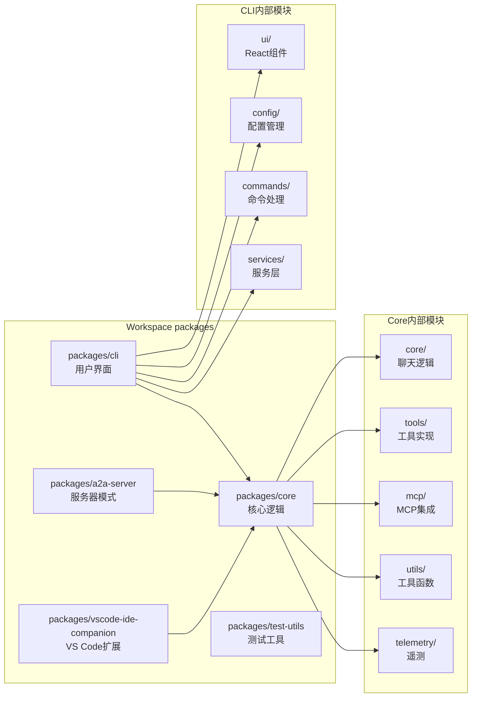
```mermaid
graph LR
    subgraph "Workspace packages"
        CLI_PKG[packages/cli<br/>用户界面]
        CORE_PKG[packages/core<br/>核心逻辑]
        A2A_PKG[packages/a2a-server<br/>服务器模式]
        VSCODE_PKG[packages/vscode-ide-companion<br/>VS Code扩展]
        TEST_PKG[packages/test-utils<br/>测试工具]
    end
    
    subgraph "CLI内部模块"
        UI[ui/<br/>React组件]
        Config[config/<br/>配置管理]
        Commands[commands/<br/>命令处理]
        Services[services/<br/>服务层]
    end
    
    subgraph "Core内部模块"
        CoreLogic[core/<br/>聊天逻辑]
        ToolsImpl[tools/<br/>工具实现]
        MCP[mcp/<br/>MCP集成]
        Utils[utils/<br/>工具函数]
        Telemetry[telemetry/<br/>遥测]
    end
    
    CLI_PKG --> CORE_PKG
    A2A_PKG --> CORE_PKG
    VSCODE_PKG --> CORE_PKG
    
    CLI_PKG --> UI
    CLI_PKG --> Config
    CLI_PKG --> Commands
    CLI_PKG --> Services
    
    CORE_PKG --> CoreLogic
    CORE_PKG --> ToolsImpl
    CORE_PKG --> MCP
    CORE_PKG --> Utils
    CORE_PKG --> Telemetry
```

---

## 4. 核心类与数据流

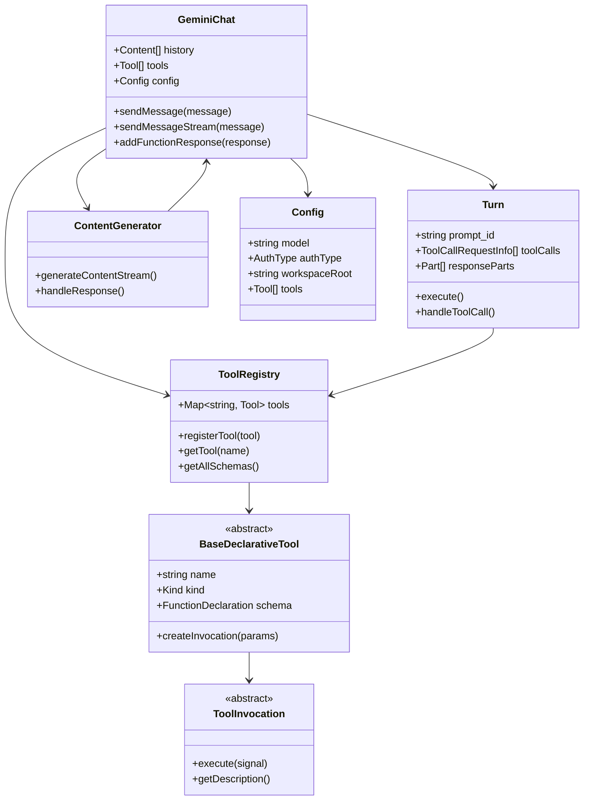
```mermaid
classDiagram
    class GeminiChat {
        +Content[] history
        +Tool[] tools
        +Config config
        +sendMessage(message)
        +sendMessageStream(message)
        +addFunctionResponse(response)
    }
    
    class Turn {
        +string prompt_id
        +ToolCallRequestInfo[] toolCalls
        +Part[] responseParts
        +execute()
        +handleToolCall()
    }
    
    class ToolRegistry {
        +Map~string, Tool~ tools
        +registerTool(tool)
        +getTool(name)
        +getAllSchemas()
    }
    
    class BaseDeclarativeTool {
        <<abstract>>
        +string name
        +Kind kind
        +FunctionDeclaration schema
        +createInvocation(params)
    }
    
    class ToolInvocation {
        <<abstract>>
        +execute(signal)
        +getDescription()
    }
    
    class ContentGenerator {
        +generateContentStream()
        +handleResponse()
    }
    
    class Config {
        +string model
        +AuthType authType
        +string workspaceRoot
        +Tool[] tools
    }
    
    GeminiChat --> Turn
    GeminiChat --> ToolRegistry
    GeminiChat --> Config
    GeminiChat --> ContentGenerator
    
    Turn --> ToolRegistry
    ToolRegistry --> BaseDeclarativeTool
    BaseDeclarativeTool --> ToolInvocation
    
    ContentGenerator --> GeminiChat
```

---

## 5. Ink UI架构 (React for Terminal)

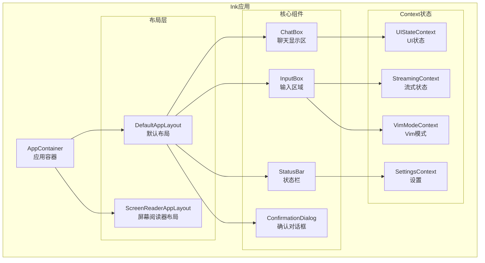
```mermaid
graph TB
    subgraph "Ink应用"
        AppContainer[AppContainer<br/>应用容器]
        
        subgraph "布局层"
            DefaultLayout[DefaultAppLayout<br/>默认布局]
            ScreenReaderLayout[ScreenReaderAppLayout<br/>屏幕阅读器布局]
        end
        
        subgraph "核心组件"
            ChatBox[ChatBox<br/>聊天显示区]
            InputBox[InputBox<br/>输入区域]
            StatusBar[StatusBar<br/>状态栏]
            ConfirmDialog[ConfirmationDialog<br/>确认对话框]
        end
        
        subgraph "Context状态"
            UIStateContext[UIStateContext<br/>UI状态]
            StreamingContext[StreamingContext<br/>流式状态]
            SettingsContext[SettingsContext<br/>设置]
            VimModeContext[VimModeContext<br/>Vim模式]
        end
    end
    
    AppContainer --> DefaultLayout
    AppContainer --> ScreenReaderLayout
    
    DefaultLayout --> ChatBox
    DefaultLayout --> InputBox
    DefaultLayout --> StatusBar
    DefaultLayout --> ConfirmDialog
    
    ChatBox --> UIStateContext
    InputBox --> StreamingContext
    StatusBar --> SettingsContext
    InputBox --> VimModeContext
```

---

## 6. 工具系统架构

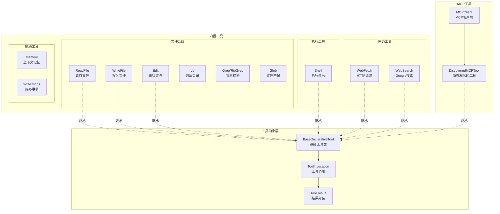
```mermaid
graph TB
    subgraph "工具抽象层"
        BaseDeclarativeTool[BaseDeclarativeTool<br/>基础工具类]
        ToolInvocation[ToolInvocation<br/>工具调用]
        ToolResult[ToolResult<br/>结果封装]
    end
    
    subgraph "内置工具"
        subgraph "文件系统"
            ReadFile[ReadFile<br/>读取文件]
            WriteFile[WriteFile<br/>写入文件]
            EditFile[Edit<br/>编辑文件]
            ListDir[Ls<br/>列出目录]
            Grep[Grep/RipGrep<br/>文本搜索]
            Glob[Glob<br/>文件匹配]
        end
        
        subgraph "执行工具"
            Shell[Shell<br/>执行命令]
        end
        
        subgraph "网络工具"
            WebFetch[WebFetch<br/>HTTP请求]
            WebSearch[WebSearch<br/>Google搜索]
        end
        
        subgraph "辅助工具"
            Memory[Memory<br/>上下文记忆]
            WriteTodos[WriteTodos<br/>待办事项]
        end
    end
    
    subgraph "MCP工具"
        MCPClient[MCPClient<br/>MCP客户端]
        DiscoveredMCPTool[DiscoveredMCPTool<br/>动态发现的工具]
    end
    
    BaseDeclarativeTool --> ToolInvocation
    ToolInvocation --> ToolResult
    
    ReadFile -.继承.-> BaseDeclarativeTool
    WriteFile -.继承.-> BaseDeclarativeTool
    EditFile -.继承.-> BaseDeclarativeTool
    Shell -.继承.-> BaseDeclarativeTool
    WebFetch -.继承.-> BaseDeclarativeTool
    WebSearch -.继承.-> BaseDeclarativeTool
    
    MCPClient --> DiscoveredMCPTool
    DiscoveredMCPTool -.继承.-> BaseDeclarativeTool
```

---

## 7. 认证流程

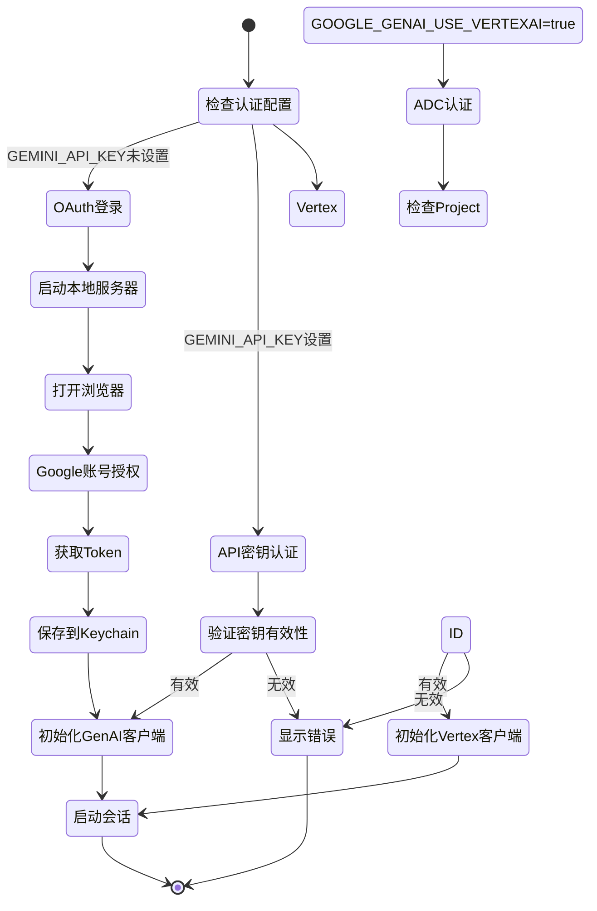
```mermaid
stateDiagram-v2
    [*] --> 检查认证配置
    
    检查认证配置 --> OAuth登录: GEMINI_API_KEY未设置
    检查认证配置 --> API密钥认证: GEMINI_API_KEY设置
    检查认证配置 --> Vertex AI认证: GOOGLE_GENAI_USE_VERTEXAI=true
    
    OAuth登录 --> 启动本地服务器
    启动本地服务器 --> 打开浏览器
    打开浏览器 --> Google账号授权
    Google账号授权 --> 获取Token
    获取Token --> 保存到Keychain
    
    API密钥认证 --> 验证密钥有效性
    验证密钥有效性 --> 初始化GenAI客户端: 有效
    验证密钥有效性 --> 显示错误: 无效
    
    Vertex AI认证 --> ADC认证
    ADC认证 --> 检查Project ID
    检查Project ID --> 初始化Vertex客户端: 有效
    检查Project ID --> 显示错误: 无效
    
    保存到Keychain --> 初始化GenAI客户端
    初始化GenAI客户端 --> 启动会话
    初始化Vertex客户端 --> 启动会话
    
    启动会话 --> [*]
    显示错误 --> [*]
```

---

## 8. 工具执行与确认流程

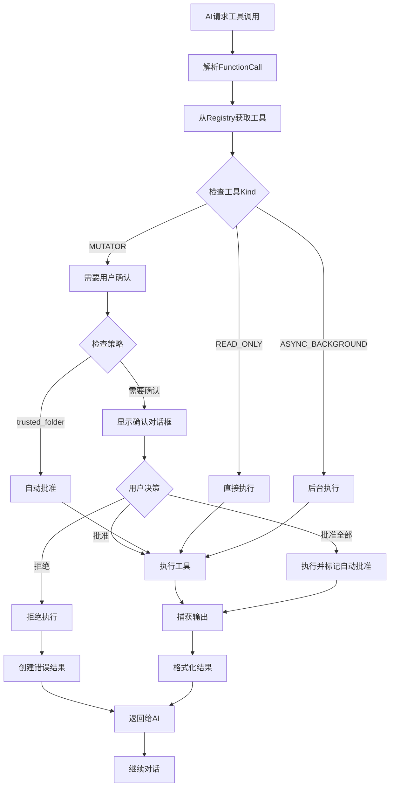
```mermaid
flowchart TD
    Start[AI请求工具调用] --> ParseCall[解析FunctionCall]
    ParseCall --> GetTool[从Registry获取工具]
    
    GetTool --> CheckKind{检查工具Kind}
    
    CheckKind -->|MUTATOR| NeedConfirm[需要用户确认]
    CheckKind -->|READ_ONLY| DirectExec[直接执行]
    CheckKind -->|ASYNC_BACKGROUND| Background[后台执行]
    
    NeedConfirm --> CheckPolicy{检查策略}
    CheckPolicy -->|trusted_folder| AutoApprove[自动批准]
    CheckPolicy -->|需要确认| ShowDialog[显示确认对话框]
    
    ShowDialog --> UserDecision{用户决策}
    UserDecision -->|批准| Execute[执行工具]
    UserDecision -->|拒绝| Reject[拒绝执行]
    UserDecision -->|批准全部| ExecuteWithFlag[执行并标记自动批准]
    
    AutoApprove --> Execute
    DirectExec --> Execute
    Background --> Execute
    
    Execute --> CaptureOutput[捕获输出]
    CaptureOutput --> FormatResult[格式化结果]
    
    Reject --> CreateErrorResult[创建错误结果]
    CreateErrorResult --> ReturnToAI[返回给AI]
    
    FormatResult --> ReturnToAI
    ExecuteWithFlag --> CaptureOutput
    
    ReturnToAI --> End[继续对话]
```

---

## 9. MCP (Model Context Protocol) 集成

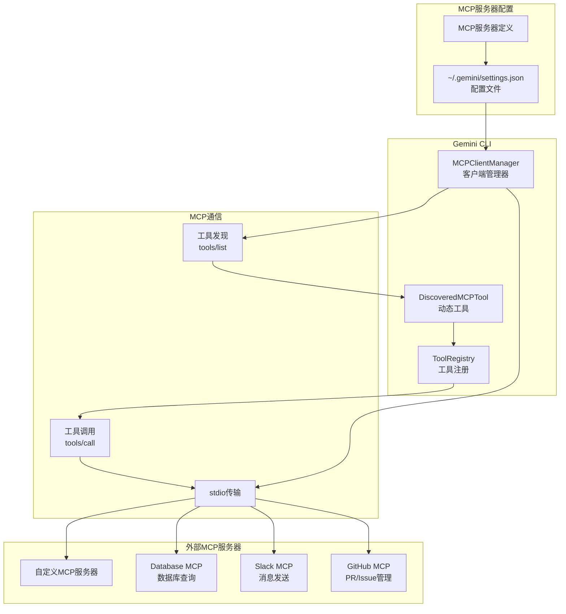
```mermaid
graph TB
    subgraph "Gemini CLI"
        MCPManager[MCPClientManager<br/>客户端管理器]
        MCPTool[DiscoveredMCPTool<br/>动态工具]
        ToolRegistry[ToolRegistry<br/>工具注册]
    end
    
    subgraph "MCP服务器配置"
        Settings[~/.gemini/settings.json<br/>配置文件]
        ServerDef[MCP服务器定义]
    end
    
    subgraph "外部MCP服务器"
        GitHub[GitHub MCP<br/>PR/Issue管理]
        Slack[Slack MCP<br/>消息发送]
        Database[Database MCP<br/>数据库查询]
        Custom[自定义MCP服务器]
    end
    
    subgraph "MCP通信"
        StdIO[stdio传输]
        Discovery[工具发现<br/>tools/list]
        Invocation[工具调用<br/>tools/call]
    end
    
    Settings --> MCPManager
    ServerDef --> Settings
    
    MCPManager --> StdIO
    StdIO --> GitHub
    StdIO --> Slack
    StdIO --> Database
    StdIO --> Custom
    
    MCPManager --> Discovery
    Discovery --> MCPTool
    MCPTool --> ToolRegistry
    
    ToolRegistry --> Invocation
    Invocation --> StdIO
```

---

## 10. 会话管理与Checkpointing

```mermaid
sequenceDiagram
    participant User
    participant CLI
    participant Chat
    participant Recording
    participant FileSystem
    
    User->>CLI: 开始新会话
    CLI->>Chat: 初始化GeminiChat
    Chat->>Recording: 启动记录服务
    
    loop 对话回合
        User->>CLI: 发送消息
        CLI->>Chat: sendMessage()
        Chat->>Recording: 记录用户消息
        
        Chat->>Chat: 调用Gemini API
        
        alt 工具调用
            Chat->>Chat: 执行工具
            Chat->>Recording: 记录工具调用
            Chat->>Recording: 记录工具结果
        end
        
        Chat->>Recording: 记录AI响应
    end
    
    alt 用户保存检查点
        User->>CLI: /checkpoint save
        CLI->>Recording: 保存当前状态
        Recording->>FileSystem: 写入 ~/.gemini/checkpoints/{id}.json
        FileSystem-->>User: 返回checkpoint ID
    end
    
    alt 用户恢复检查点
        User->>CLI: gemini --checkpoint {id}
        CLI->>FileSystem: 读取checkpoint文件
        FileSystem->>CLI: 返回历史数据
        CLI->>Chat: 重建history
        Chat-->>User: 继续对话
    end
```

---

## 11. 扩展系统架构

```mermaid
graph TB
    subgraph "扩展定义"
        ExtFile[gemini-extension.json<br/>扩展清单]
        Commands[commands配置]
        Metadata[元数据]
    end
    
    subgraph "扩展加载"
        ExtLoader[ExtensionLoader<br/>扩展加载器]
        ExtStorage[ExtensionStorage<br/>扩展存储]
        ExtManager[ExtensionEnablementManager<br/>启用管理]
    end
    
    subgraph "命令系统"
        CmdService[CommandService<br/>命令服务]
        BuiltinLoader[BuiltinCommandLoader<br/>内置命令]
        FileLoader[FileCommandLoader<br/>文件命令]
        McpLoader[McpPromptLoader<br/>MCP提示]
    end
    
    subgraph "命令类型"
        SlashCmd[斜杠命令<br/>/help, /chat]
        CustomCmd[自定义命令<br/>用户定义]
        McpPrompt[MCP提示<br/>外部集成]
    end
    
    ExtFile --> ExtLoader
    ExtLoader --> ExtStorage
    ExtStorage --> ExtManager
    
    ExtManager --> CmdService
    
    CmdService --> BuiltinLoader
    CmdService --> FileLoader
    CmdService --> McpLoader
    
    BuiltinLoader --> SlashCmd
    FileLoader --> CustomCmd
    McpLoader --> McpPrompt
```

---

## 12. 数据流与状态管理

```mermaid
graph LR
    subgraph "输入层"
        UserInput[用户输入]
        FileInput[文件上传]
        ImageInput[图片输入]
    end
    
    subgraph "处理层"
        InputProcessor[输入处理器]
        PromptBuilder[提示构建器]
        ContextBuilder[上下文构建器]
    end
    
    subgraph "状态层"
        History[对话历史<br/>Content[]]
        StreamingState[流式状态]
        UIState[UI状态]
        SessionStats[会话统计]
    end
    
    subgraph "输出层"
        TextRenderer[文本渲染器]
        MarkdownRenderer[Markdown渲染器]
        ThoughtRenderer[思考过程渲染]
        ToolCallRenderer[工具调用渲染]
    end
    
    UserInput --> InputProcessor
    FileInput --> InputProcessor
    ImageInput --> InputProcessor
    
    InputProcessor --> PromptBuilder
    InputProcessor --> ContextBuilder
    
    PromptBuilder --> History
    ContextBuilder --> History
    
    History --> StreamingState
    StreamingState --> UIState
    UIState --> SessionStats
    
    StreamingState --> TextRenderer
    StreamingState --> MarkdownRenderer
    StreamingState --> ThoughtRenderer
    StreamingState --> ToolCallRenderer
```

---

## 13. Agent-to-Agent (A2A) 服务器模式

```mermaid
graph TB
    subgraph "A2A服务器"
        HTTPServer[HTTP服务器<br/>Express]
        Endpoints[API端点]
        AgentExecutor[AgentExecutor<br/>代理执行器]
    end
    
    subgraph "任务管理"
        TaskQueue[任务队列]
        TaskStore[任务存储<br/>GCS/本地]
        TaskState[任务状态机]
    end
    
    subgraph "外部客户端"
        GitHub[GitHub Actions]
        CI[CI/CD系统]
        WebHook[WebHook触发器]
        CustomClient[自定义客户端]
    end
    
    GitHub --> Endpoints
    CI --> Endpoints
    WebHook --> Endpoints
    CustomClient --> Endpoints
    
    Endpoints --> AgentExecutor
    AgentExecutor --> TaskQueue
    TaskQueue --> TaskStore
    TaskStore --> TaskState
    
    AgentExecutor --> GeminiChat[GeminiChat<br/>核心引擎]
    TaskState --> GeminiChat
```

---

## 14. 技术栈与依赖

```mermaid
graph TB
    subgraph "核心依赖"
        GenAI[@google/genai<br/>Gemini SDK]
        Ink[ink<br/>React终端UI]
        React[React<br/>组件框架]
        NodePTY[@lydell/node-pty<br/>终端仿真]
    end
    
    subgraph "工具依赖"
        MCP[@modelcontextprotocol/sdk<br/>MCP协议]
        ShellQuote[shell-quote<br/>Shell解析]
        SimpleGit[simple-git<br/>Git操作]
        Ripgrep[ripgrep<br/>文本搜索]
    end
    
    subgraph "测试框架"
        Vitest[vitest<br/>测试运行器]
        InkTesting[ink-testing-library<br/>UI测试]
        MSW[msw<br/>API Mock]
    end
    
    subgraph "构建工具"
        ESBuild[esbuild<br/>打包工具]
        TypeScript[TypeScript<br/>类型系统]
        ESLint[eslint<br/>代码检查]
    end
    
    GeminiCLI[Gemini CLI] --> GenAI
    GeminiCLI --> Ink
    Ink --> React
    GeminiCLI --> NodePTY
    
    GeminiCLI --> MCP
    GeminiCLI --> ShellQuote
    GeminiCLI --> SimpleGit
    GeminiCLI --> Ripgrep
    
    Testing[测试套件] --> Vitest
    Testing --> InkTesting
    Testing --> MSW
    
    Build[构建流程] --> ESBuild
    Build --> TypeScript
    Build --> ESLint
```

---

## 15. 关键特性实现细节

### 15.1 Google Search Grounding

```mermaid
sequenceDiagram
    participant User
    participant Chat
    participant API as Gemini API
    participant Search as Google Search
    
    User->>Chat: 询问实时信息
    Chat->>API: 发送请求(启用grounding)
    API->>Search: 搜索相关信息
    Search-->>API: 返回搜索结果
    API->>API: 整合搜索结果到上下文
    API-->>Chat: 返回基于搜索的回答
    Chat-->>User: 显示回答+引用来源
```

### 15.2 Token缓存优化

```mermaid
graph LR
    subgraph "缓存策略"
        SystemPrompt[系统提示<br/>标记为cached]
        UserInstructions[用户指令<br/>GEMINI.md]
        ContextFiles[上下文文件<br/>缓存内容]
    end
    
    subgraph "缓存效果"
        FirstCall[首次调用<br/>全量计费]
        SubsequentCall[后续调用<br/>缓存部分免费]
        CacheHit[缓存命中<br/>降低延迟]
    end
    
    SystemPrompt --> FirstCall
    UserInstructions --> FirstCall
    ContextFiles --> FirstCall
    
    FirstCall --> SubsequentCall
    SubsequentCall --> CacheHit
```

### 15.3 Thought (思考过程) 渲染

```mermaid
graph TB
    Start[AI生成Part] --> CheckType{Part类型}
    
    CheckType -->|thought=true| ParseThought[解析思考内容]
    CheckType -->|text| NormalText[普通文本]
    CheckType -->|functionCall| ToolCall[工具调用]
    
    ParseThought --> ExtractSummary[提取摘要]
    ExtractSummary --> ThoughtEvent[发送Thought事件]
    
    ThoughtEvent --> UIRender{UI渲染模式}
    UIRender -->|详细| ShowFull[显示完整思考]
    UIRender -->|简化| ShowSummary[显示摘要]
    UIRender -->|隐藏| Skip[不显示]
    
    ShowFull --> Display[渲染到终端]
    ShowSummary --> Display
    NormalText --> Display
    ToolCall --> Display
    Skip --> End[继续处理]
    Display --> End
```

---

## 总结

### 架构特点

1. **纯TypeScript实现**: 全栈JavaScript/TypeScript，统一技术栈
2. **React驱动的TUI**: 使用Ink将React组件渲染到终端
3. **工具系统灵活**: 基于抽象类的工具系统，支持动态注册
4. **MCP原生支持**: 深度集成Model Context Protocol
5. **多模式支持**: 交互式、非交互式、服务器模式
6. **丰富的认证选项**: OAuth、API Key、Vertex AI多种方式

### 核心技术栈

- **语言**: TypeScript (Node.js >= 20)
- **UI框架**: Ink (React for Terminal)
- **AI SDK**: @google/genai
- **测试**: Vitest + Ink Testing Library
- **构建**: ESBuild + Workspace (npm workspaces)
- **终端**: @lydell/node-pty (多平台终端仿真)

### 与Codex的对比

| 特性 | Gemini CLI | Codex |
|------|-----------|-------|
| 语言 | TypeScript/JavaScript | Rust |
| UI | Ink (React) | ratatui |
| 模型 | Google Gemini | OpenAI GPT |
| 认证 | OAuth/API Key/Vertex | ChatGPT/API Key |
| 工具系统 | 类型化工具定义 | Trait-based |
| MCP支持 | 原生集成 | 支持 |
| 扩展 | JSON配置+命令 | Starlark策略 |
| 沙箱 | Docker/Podman | Seatbelt/Landlock |

### 数据流总结

```
用户输入 → InputProcessor → PromptBuilder → GeminiChat
                ↓                                ↓
            Context                      generateContent
                ↓                                ↓
            历史记录 ← StreamEvents ← Gemini API
                ↓                                ↓
            UIState → InkComponents → 终端渲染
```

### 优势

- **轻量级**: 纯JavaScript，无需编译，启动快
- **可扩展**: 丰富的扩展机制和MCP支持
- **用户友好**: React组件化UI，主题系统
- **企业就绪**: Vertex AI集成，A2A服务器模式
- **开发者体验**: TypeScript类型安全，完善的测试

Gemini CLI 通过现代化的JavaScript生态和React终端UI，为开发者提供了强大而灵活的AI编程助手体验。

```

完美！我已经为您创建了一份全面的Gemini CLI项目架构分析文档。这份文档包含**15个专业的Mermaid图表**，全面展示了Gemini CLI的技术原理：

## 📊 图表内容概览

1. **整体架构图** - 展示用户交互层、核心包、Gemini API层、工具系统
2. **核心工作流程** - 从用户输入到AI响应的完整序列图
3. **包结构与模块关系** - Workspace组织和依赖关系
4. **核心类与数据流** - 类图展示关键类的关系
5. **Ink UI架构** - React for Terminal的组件结构
6. **工具系统架构** - 内置工具和MCP工具的层次结构
7. **认证流程** - 多种认证方式的状态机
8. **工具执行与确认流程** - 详细的工具调用决策树
9. **MCP集成** - Model Context Protocol的完整架构
10. **会话管理与Checkpointing** - 会话持久化机制
11. **扩展系统架构** - 扩展加载和命令系统
12. **数据流与状态管理** - 从输入到输出的数据流向
13. **A2A服务器模式** - Agent-to-Agent的服务器架构
14. **技术栈与依赖** - 完整的依赖关系图
15. **关键特性实现** - Google Search、Token缓存、Thought渲染

## 🎯 核心发现

**与Codex的主要区别**:
- **Gemini CLI**: 纯TypeScript + Ink(React) + Google Gemini
- **Codex**: Rust + ratatui + OpenAI GPT

**技术亮点**:
- React驱动的终端UI (Ink框架)
- 原生MCP支持，深度集成外部工具
- 三种认证方式: OAuth、API Key、Vertex AI
- Agent-to-Agent服务器模式支持GitHub Actions
- Google Search Grounding实时信息检索

所有图表都已使用标准Mermaid语法，可以直接渲染查看！现在您有了两份完整的架构分析文档：`codex_architecture_analysis（codex）.md` 和 `gemini_cli_architecture_analysis.md`。

---

**User**

good，继续分析qwen-code的

---

**Cursor**

好的，现在让我深入分析qwen-code项目的技术原理。

继续深入了解qwen-code的核心实现：

现在我已经充分了解了qwen-code项目。让我创建详细的技术分析文档：

```markdown
# Qwen Code 项目架构分析

## 项目概述

Qwen Code 是阿里云通义千问团队基于 **Gemini CLI** Fork并深度改造的AI代码助手，专门为 **Qwen3-Coder** 模型优化。项目采用完全的 TypeScript + Node.js 架构，重点在**解析器层面**进行了适配，以更好地支持Qwen模型的输出特性。

---

## 1. 整体架构图

```mermaid
graph TB
    subgraph "用户交互层"
        CLI[Qwen CLI<br/>命令行入口]
        InkUI[Ink终端UI<br/>React组件]
        NonInteractive[非交互模式<br/>脚本执行]
    end
    
    subgraph "核心包 (packages/core)"
        QwenContentGen[QwenContentGenerator<br/>Qwen专用生成器]
        OpenAIGen[OpenAIContentGenerator<br/>OpenAI兼容生成器]
        ToolRegistry[工具注册表]
        TurnManager[回合管理器]
    end
    
    subgraph "认证层"
        QwenOAuth[Qwen OAuth2<br/>通义千问认证]
        TokenManager[SharedTokenManager<br/>Token管理器]
        OpenAIAuth[OpenAI兼容<br/>API Key认证]
    end
    
    subgraph "API层"
        QwenAPI[Qwen API<br/>通义千问]
        DashScope[DashScope<br/>阿里云百炼]
        ModelScope[ModelScope<br/>魔搭社区]
        OpenRouter[OpenRouter<br/>国际版]
    end
    
    subgraph "核心增强"
        StreamingParser[StreamingToolCallParser<br/>流式解析器]
        ErrorHandler[EnhancedErrorHandler<br/>增强错误处理]
        Pipeline[ContentGenerationPipeline<br/>内容生成管道]
    end
    
    subgraph "工具系统"
        FileTools[文件工具]
        ShellTool[Shell执行]
        WebTools[网络工具]
        MCPTools[MCP工具]
    end
    
    CLI --> InkUI
    CLI --> NonInteractive
    
    InkUI --> QwenContentGen
    InkUI --> OpenAIGen
    
    QwenContentGen --> QwenOAuth
    QwenContentGen --> TokenManager
    OpenAIGen --> OpenAIAuth
    
    QwenOAuth --> QwenAPI
    TokenManager --> DashScope
    OpenAIAuth --> ModelScope
    OpenAIAuth --> OpenRouter
    
    QwenContentGen --> StreamingParser
    OpenAIGen --> StreamingParser
    QwenContentGen --> Pipeline
    OpenAIGen --> Pipeline
    
    Pipeline --> ErrorHandler
    Pipeline --> ToolRegistry
    ToolRegistry --> FileTools
    ToolRegistry --> ShellTool
    ToolRegistry --> WebTools
    ToolRegistry --> MCPTools
```

---

## 2. 核心工作流程

```mermaid
sequenceDiagram
    participant User as 用户
    participant CLI as CLI入口
    participant UI as Ink UI
    participant QwenGen as QwenContentGenerator
    participant TokenMgr as SharedTokenManager
    participant OAuth as QwenOAuth2
    participant Parser as StreamingToolCallParser
    participant API as Qwen/DashScope API
    participant Tools as 工具系统
    
    User->>CLI: 运行 qwen
    CLI->>CLI: 检查认证状态
    
    alt 首次使用
        CLI->>OAuth: 启动OAuth流程
        OAuth->>User: 打开浏览器授权
        User->>OAuth: 完成授权
        OAuth->>TokenMgr: 保存Token
    end
    
    CLI->>UI: 启动Ink UI
    User->>UI: 输入提示词
    
    UI->>QwenGen: 提交消息
    QwenGen->>TokenMgr: 获取有效Token
    
    alt Token已过期
        TokenMgr->>OAuth: 刷新Token
        OAuth-->>TokenMgr: 返回新Token
    end
    
    TokenMgr-->>QwenGen: 返回Token+Endpoint
    
    QwenGen->>API: generateContentStream(流式)
    
    loop 流式响应
        API-->>QwenGen: 返回Chunk
        QwenGen->>Parser: 解析工具调用
        
        alt 工具调用Chunk
            Parser->>Parser: 累积Buffer
            Parser->>Parser: 跟踪JSON深度
            
            alt JSON完整
                Parser-->>QwenGen: 返回完整工具调用
                QwenGen-->>UI: 显示工具请求
                UI->>User: 请求确认
                User-->>UI: 批准
                UI-->>Tools: 执行工具
                Tools-->>QwenGen: 返回结果
                QwenGen->>API: 发送FunctionResponse
            end
        else 文本Chunk
            QwenGen-->>UI: 流式更新文本
            UI-->>User: 实时显示
        end
    end
    
    API-->>QwenGen: 完成信号
    QwenGen-->>UI: 更新完成状态
    UI-->>User: 显示Token使用
```

---

## 3. 关键差异：Qwen Code vs Gemini CLI

```mermaid
graph LR
    subgraph "Gemini CLI原始架构"
        GeminiClient[Gemini SDK<br/>@google/genai]
        GeminiParser[标准解析器]
        GeminiAuth[Google OAuth]
    end
    
    subgraph "Qwen Code改造架构"
        QwenAdapter[OpenAI兼容适配器]
        QwenParser[StreamingToolCallParser<br/>增强解析器]
        QwenAuthSys[多认证系统]
        
        subgraph "解析器增强"
            BufferMgmt[Buffer管理]
            DepthTrack[深度追踪]
            IndexCollision[索引碰撞处理]
            JsonRepair[JSON修复]
        end
        
        subgraph "认证系统"
            QwenOAuth2[Qwen OAuth2]
            APIKey[API Key模式]
            TokenRefresh[自动刷新]
        end
    end
    
    GeminiClient -.Fork改造.-> QwenAdapter
    GeminiParser -.大幅增强.-> QwenParser
    GeminiAuth -.扩展.-> QwenAuthSys
    
    QwenParser --> BufferMgmt
    QwenParser --> DepthTrack
    QwenParser --> IndexCollision
    QwenParser --> JsonRepair
    
    QwenAuthSys --> QwenOAuth2
    QwenAuthSys --> APIKey
    QwenAuthSys --> TokenRefresh
```

---

## 4. StreamingToolCallParser 核心创新

```mermaid
graph TB
    subgraph "问题场景"
        Problem1[工具调用索引碰撞<br/>同索引被复用]
        Problem2[JSON片段化<br/>跨多个Chunk]
        Problem3[缺失ID/Name<br/>元数据不完整]
        Problem4[格式不一致<br/>空字符串/部分JSON]
    end
    
    subgraph "解析器核心机制"
        BufferMap[buffers: Map<index, string><br/>累积每个工具调用的Buffer]
        DepthMap[depths: Map<index, number><br/>追踪JSON嵌套深度]
        StringMap[inStrings: Map<index, boolean><br/>是否在字符串内]
        MetaMap[toolCallMeta: Map<index, metadata><br/>存储ID和Name]
        IDIndexMap[idToIndexMap: Map<id, actualIndex><br/>解决索引碰撞]
    end
    
    subgraph "处理流程"
        AddChunk[addChunk<br/>接收新Chunk]
        ResolveIndex[解决索引碰撞<br/>ID映射]
        AccumulateBuffer[累积到Buffer]
        TrackState[更新解析状态<br/>深度/字符串]
        CheckComplete{深度==0?}
        AttemptParse[尝试解析JSON]
        RepairJSON[修复不完整JSON]
        ReturnResult[返回解析结果]
    end
    
    Problem1 --> BufferMap
    Problem2 --> DepthMap
    Problem3 --> MetaMap
    Problem4 --> StringMap
    
    BufferMap --> AddChunk
    DepthMap --> AddChunk
    StringMap --> AddChunk
    MetaMap --> AddChunk
    IDIndexMap --> AddChunk
    
    AddChunk --> ResolveIndex
    ResolveIndex --> AccumulateBuffer
    AccumulateBuffer --> TrackState
    TrackState --> CheckComplete
    CheckComplete -->|是| AttemptParse
    CheckComplete -->|否| ReturnResult
    AttemptParse -->|失败| RepairJSON
    AttemptParse -->|成功| ReturnResult
    RepairJSON --> ReturnResult
```

---

## 5. Qwen OAuth2 认证流程

```mermaid
sequenceDiagram
    participant User
    participant CLI
    participant OAuth as QwenOAuth2
    participant TokenMgr as SharedTokenManager
    participant Browser
    participant QwenServer as chat.qwen.ai
    participant FileSystem as ~/.qwen/oauth_creds.json
    
    User->>CLI: 首次运行 qwen
    CLI->>OAuth: 检查本地凭证
    OAuth->>FileSystem: 读取oauth_creds.json
    FileSystem-->>OAuth: 文件不存在
    
    OAuth->>OAuth: 生成PKCE pair<br/>(code_verifier, code_challenge)
    OAuth->>QwenServer: POST /device/code<br/>client_id + code_challenge
    QwenServer-->>OAuth: device_code + user_code + verification_uri
    
    OAuth->>User: 显示二维码/链接
    OAuth->>Browser: 打开verification_uri_complete
    User->>Browser: 扫码/点击授权
    Browser->>QwenServer: 用户授权
    
    loop 轮询Token
        OAuth->>QwenServer: POST /token<br/>device_code + code_verifier
        
        alt 等待授权
            QwenServer-->>OAuth: authorization_pending
            OAuth->>OAuth: 等待5秒
        else 授权完成
            QwenServer-->>OAuth: access_token + refresh_token + resource_url
            OAuth->>TokenMgr: 保存Token
            TokenMgr->>FileSystem: 写入oauth_creds.json
        end
    end
    
    OAuth-->>CLI: 认证成功
    CLI->>User: 开始会话
    
    Note over User,FileSystem: 后续使用
    
    CLI->>TokenMgr: 获取Token
    TokenMgr->>FileSystem: 读取oauth_creds.json
    
    alt Token有效
        TokenMgr-->>CLI: 返回Token
    else Token过期
        TokenMgr->>QwenServer: POST /token<br/>refresh_token
        QwenServer-->>TokenMgr: 新的access_token
        TokenMgr->>FileSystem: 更新oauth_creds.json
        TokenMgr-->>CLI: 返回新Token
    end
```

---

## 6. OpenAI兼容层架构

```mermaid
graph TB
    subgraph "Provider抽象层"
        OpenAIProvider[OpenAICompatibleProvider<br/>基础接口]
        
        subgraph "具体Provider实现"
            DefaultProvider[DefaultProvider<br/>标准OpenAI]
            DashScopeProvider[DashScopeProvider<br/>阿里云百炼]
            DeepSeekProvider[DeepSeekProvider<br/>DeepSeek]
            OpenRouterProvider[OpenRouterProvider<br/>OpenRouter]
        end
    end
    
    subgraph "Pipeline组件"
        Pipeline[ContentGenerationPipeline]
        
        subgraph "Pipeline内部"
            Converter[请求转换器<br/>Gemini→OpenAI]
            Client[OpenAI客户端]
            StreamParser[StreamingToolCallParser]
            ErrorHandler[EnhancedErrorHandler]
            Telemetry[TelemetryService]
        end
    end
    
    subgraph "内容生成器"
        OpenAIGen[OpenAIContentGenerator]
        QwenGen[QwenContentGenerator]
    end
    
    OpenAIProvider --> DefaultProvider
    OpenAIProvider --> DashScopeProvider
    OpenAIProvider --> DeepSeekProvider
    OpenAIProvider --> OpenRouterProvider
    
    DefaultProvider --> Pipeline
    DashScopeProvider --> Pipeline
    DeepSeekProvider --> Pipeline
    OpenRouterProvider --> Pipeline
    
    Pipeline --> Converter
    Pipeline --> Client
    Pipeline --> StreamParser
    Pipeline --> ErrorHandler
    Pipeline --> Telemetry
    
    OpenAIGen --> Pipeline
    QwenGen -.继承.-> OpenAIGen
    QwenGen --> DashScopeProvider
```

---

## 7. Vision Model自动切换机制

```mermaid
stateDiagram-v2
    [*] --> 检测输入
    
    检测输入 --> 包含图片: 发现图片
    检测输入 --> 无图片: 纯文本
    
    无图片 --> 使用当前模型
    
    包含图片 --> 检查设置
    
    检查设置 --> 显示对话框: vlmSwitchMode未设置
    检查设置 --> 一次性切换: vlmSwitchMode=once
    检查设置 --> 会话切换: vlmSwitchMode=session
    检查设置 --> 不切换: vlmSwitchMode=persist
    检查设置 --> 禁用视觉: visionModelPreview=false
    
    显示对话框 --> 用户选择
    用户选择 --> 一次性切换: 选择"once"
    用户选择 --> 会话切换: 选择"session"
    用户选择 --> 不切换: 选择"persist"
    
    一次性切换 --> 切换到Vision模型
    会话切换 --> 切换到Vision模型
    不切换 --> 使用当前模型
    禁用视觉 --> 使用当前模型
    
    切换到Vision模型 --> 处理图片请求
    处理图片请求 --> 恢复原模型: mode=once
    处理图片请求 --> 保持Vision模型: mode=session
    
    恢复原模型 --> [*]
    保持Vision模型 --> [*]
    使用当前模型 --> [*]
```

---

## 8. 会话Token管理与压缩

```mermaid
graph LR
    subgraph "Token监控"
        InputTokens[输入Token统计]
        OutputTokens[输出Token统计]
        HistoryTokens[历史Token统计]
        TotalCalc[总计计算]
    end
    
    subgraph "Session配置"
        SessionLimit[sessionTokenLimit<br/>会话Token上限]
        DefaultValue[默认值: 32000]
    end
    
    subgraph "达到上限处理"
        CheckLimit{超过限制?}
        
        subgraph "用户选项"
            Compress[/compress命令<br/>压缩历史]
            Clear[/clear命令<br/>清空历史]
            Stats[/stats命令<br/>查看统计]
        end
        
        subgraph "压缩机制"
            SelectHistory[选择压缩范围]
            CallSummarizer[调用Summarizer]
            ReplaceHistory[替换为摘要]
            RecalcTokens[重新计算Token]
        end
    end
    
    InputTokens --> TotalCalc
    OutputTokens --> TotalCalc
    HistoryTokens --> TotalCalc
    
    TotalCalc --> CheckLimit
    SessionLimit --> CheckLimit
    
    CheckLimit -->|是| Compress
    CheckLimit -->|是| Clear
    CheckLimit -->|是| Stats
    
    Compress --> SelectHistory
    SelectHistory --> CallSummarizer
    CallSummarizer --> ReplaceHistory
    ReplaceHistory --> RecalcTokens
    
    Clear --> TotalCalc
    RecalcTokens --> TotalCalc
```

---

## 9. 错误处理与重试机制

```mermaid
graph TB
    subgraph "EnhancedErrorHandler"
        CatchError[捕获错误]
        ClassifyError{错误分类}
        
        subgraph "错误类型"
            AuthError[认证错误<br/>401/403]
            RateLimitError[限流错误<br/>429]
            QuotaError[配额错误<br/>quota_exceeded]
            NetworkError[网络错误<br/>ECONNRESET]
            TimeoutError[超时错误<br/>ETIMEDOUT]
            ServerError[服务器错误<br/>5xx]
        end
        
        subgraph "处理策略"
            RefreshToken[刷新Token]
            BackoffRetry[退避重试]
            FriendlyMessage[友好错误提示]
            LogError[记录错误日志]
            SuppressLog[抑制日志<br/>避免噪音]
        end
    end
    
    CatchError --> ClassifyError
    
    ClassifyError --> AuthError
    ClassifyError --> RateLimitError
    ClassifyError --> QuotaError
    ClassifyError --> NetworkError
    ClassifyError --> TimeoutError
    ClassifyError --> ServerError
    
    AuthError --> RefreshToken
    AuthError --> SuppressLog
    RateLimitError --> BackoffRetry
    RateLimitError --> FriendlyMessage
    QuotaError --> FriendlyMessage
    QuotaError --> LogError
    NetworkError --> BackoffRetry
    TimeoutError --> BackoffRetry
    ServerError --> BackoffRetry
    ServerError --> LogError
```

---

## 10. 包结构与模块依赖

```mermaid
graph TB
    subgraph "Workspace Packages"
        CLI[packages/cli<br/>CLI包]
        CORE[packages/core<br/>核心包]
        VSCODE[packages/vscode-ide-companion<br/>VS Code扩展]
        TEST[packages/test-utils<br/>测试工具]
    end
    
    subgraph "Core内部模块"
        QwenMod[qwen/<br/>Qwen专用]
        CoreLogic[core/<br/>核心逻辑]
        ToolsMod[tools/<br/>工具实现]
        MCPMod[mcp/<br/>MCP集成]
        SubAgents[subagents/<br/>子代理]
    end
    
    subgraph "Qwen模块详情"
        QwenOAuth2[qwenOAuth2.ts<br/>OAuth认证]
        QwenContentGen[qwenContentGenerator.ts<br/>内容生成器]
        SharedTokenMgr[sharedTokenManager.ts<br/>Token管理]
    end
    
    subgraph "OpenAI兼容模块"
        OpenAIGen[openaiContentGenerator/<br/>生成器]
        Pipeline[pipeline.ts<br/>管道]
        StreamParser[streamingToolCallParser.ts<br/>流式解析]
        Providers[provider/<br/>Provider实现]
    end
    
    CLI --> CORE
    VSCODE --> CORE
    
    CORE --> QwenMod
    CORE --> CoreLogic
    CORE --> ToolsMod
    CORE --> MCPMod
    CORE --> SubAgents
    
    QwenMod --> QwenOAuth2
    QwenMod --> QwenContentGen
    QwenMod --> SharedTokenMgr
    
    CoreLogic --> OpenAIGen
    OpenAIGen --> Pipeline
    OpenAIGen --> StreamParser
    OpenAIGen --> Providers
    
    QwenContentGen -.继承.-> OpenAIGen
```

---

## 11. 技术栈与依赖对比

```mermaid
graph LR
    subgraph "Qwen Code技术栈"
        QwenLang[TypeScript/Node.js 20+]
        QwenUI[Ink + React]
        QwenAPI[OpenAI兼容API]
        QwenAuth[OAuth2 + PKCE]
        QwenParser[自定义StreamingParser]
        QwenTest[Vitest]
    end
    
    subgraph "Gemini CLI技术栈"
        GeminiLang[TypeScript/Node.js 20+]
        GeminiUI[Ink + React]
        GeminiAPI[@google/genai SDK]
        GeminiAuth[Google OAuth]
        GeminiParser[标准解析器]
        GeminiTest[Vitest]
    end
    
    subgraph "关键差异"
        APILayer[API层<br/>OpenAI兼容 vs Google SDK]
        ParserLayer[解析层<br/>增强解析 vs 标准解析]
        AuthLayer[认证层<br/>多Provider vs 单一Google]
    end
    
    QwenAPI -.主要差异.-> APILayer
    GeminiAPI -.主要差异.-> APILayer
    
    QwenParser -.核心创新.-> ParserLayer
    GeminiParser -.核心创新.-> ParserLayer
    
    QwenAuth -.扩展.-> AuthLayer
    GeminiAuth -.扩展.-> AuthLayer
```

---

## 12. 核心创新点总结

### 12.1 StreamingToolCallParser

```mermaid
graph TB
    Innovation1[索引碰撞解决<br/>idToIndexMap机制]
    Innovation2[JSON深度追踪<br/>准确判断完整性]
    Innovation3[字符串边界检测<br/>避免误判]
    Innovation4[自动JSON修复<br/>处理不完整输出]
    Innovation5[元数据分离存储<br/>toolCallMeta Map]
    
    Problem[Qwen模型工具调用<br/>流式输出不稳定]
    
    Problem --> Innovation1
    Problem --> Innovation2
    Problem --> Innovation3
    Problem --> Innovation4
    Problem --> Innovation5
    
    Innovation1 --> Solution[稳定可靠的<br/>工具调用解析]
    Innovation2 --> Solution
    Innovation3 --> Solution
    Innovation4 --> Solution
    Innovation5 --> Solution
```

### 12.2 认证系统增强

```mermaid
graph LR
    QwenOAuth[Qwen OAuth2<br/>通义千问官方]
    DashScope[DashScope<br/>阿里云百炼]
    ModelScope[ModelScope<br/>魔搭社区]
    OpenRouter[OpenRouter<br/>国际路由]
    CustomAPI[自定义API<br/>OpenAI兼容]
    
    SharedMgr[SharedTokenManager<br/>统一Token管理]
    
    QwenOAuth --> SharedMgr
    DashScope --> SharedMgr
    ModelScope --> SharedMgr
    OpenRouter --> SharedMgr
    CustomAPI --> SharedMgr
    
    SharedMgr --> Features[功能特性]
    
    Features --> AutoRefresh[自动刷新Token]
    Features --> EndpointSync[Endpoint同步]
    Features --> CredPersist[凭证持久化]
    Features --> ErrorHandle[统一错误处理]
```

---

## 13. 数据流与状态管理

```mermaid
graph LR
    subgraph "输入处理"
        UserInput[用户输入]
        ImageDetect[图片检测]
        VisionSwitch[Vision模型切换]
    end
    
    subgraph "内容生成"
        TokenGet[获取Token]
        BuildRequest[构建请求]
        StreamCall[流式API调用]
    end
    
    subgraph "流式解析"
        ChunkReceive[接收Chunk]
        ParseState[解析状态]
        
        subgraph "状态类型"
            TextChunk[文本Chunk]
            ToolChunk[工具调用Chunk]
            ThoughtChunk[思考过程Chunk]
        end
    end
    
    subgraph "输出渲染"
        UIUpdate[UI更新]
        ToolExec[工具执行]
        ResultDisplay[结果显示]
    end
    
    UserInput --> ImageDetect
    ImageDetect --> VisionSwitch
    VisionSwitch --> TokenGet
    
    TokenGet --> BuildRequest
    BuildRequest --> StreamCall
    
    StreamCall --> ChunkReceive
    ChunkReceive --> ParseState
    
    ParseState --> TextChunk
    ParseState --> ToolChunk
    ParseState --> ThoughtChunk
    
    TextChunk --> UIUpdate
    ToolChunk --> ToolExec
    ThoughtChunk --> UIUpdate
    
    UIUpdate --> ResultDisplay
    ToolExec --> ResultDisplay
```

---

## 14. Benchmark性能

```mermaid
graph TB
    subgraph "Terminal-Bench基准测试"
        TestSuite[测试套件]
        
        subgraph "测试结果"
            Qwen480[Qwen3-Coder-480A35<br/>准确率: 37.5%]
            Qwen30[Qwen3-Coder-30BA3B<br/>准确率: 31.3%]
        end
        
        subgraph "测试项目"
            FileOps[文件操作]
            ShellCmd[Shell命令]
            CodeEdit[代码编辑]
            MultiStep[多步骤任务]
        end
    end
    
    TestSuite --> Qwen480
    TestSuite --> Qwen30
    
    TestSuite --> FileOps
    TestSuite --> ShellCmd
    TestSuite --> CodeEdit
    TestSuite --> MultiStep
```

---

## 总结

### 核心特点

1. **基于Gemini CLI深度改造**: Fork自Google Gemini CLI，保留核心架构
2. **解析器层面大幅增强**: StreamingToolCallParser是核心创新
3. **多Provider认证支持**: 支持Qwen OAuth + 多个OpenAI兼容服务
4. **专为Qwen模型优化**: 处理Qwen3-Coder特有的输出特性
5. **Vision模型智能切换**: 自动检测图片并切换到视觉模型
6. **完善的Token管理**: SharedTokenManager统一管理所有认证

### 技术栈

- **语言**: TypeScript (Node.js >= 20)
- **UI框架**: Ink (React for Terminal)
- **API**: OpenAI Compatible API
- **认证**: OAuth2 + PKCE
- **测试**: Vitest
- **构建**: ESBuild

### 与Gemini CLI的主要差异

| 特性 | Qwen Code | Gemini CLI |
|------|-----------|------------|
| **API层** | OpenAI兼容 | Google GenAI SDK |
| **核心创新** | StreamingToolCallParser | 标准解析器 |
| **认证** | 多Provider (Qwen/DashScope/ModelScope) | Google OAuth |
| **模型支持** | Qwen3-Coder系列 | Gemini系列 |
| **解析器** | 索引碰撞处理+JSON修复 | 标准JSON解析 |
| **免费额度** | 2000请求/天 (Qwen OAuth) | 60请求/分钟 |

### 核心创新：StreamingToolCallParser

```
问题：Qwen模型工具调用输出不稳定
解决方案：
1. 索引碰撞处理 (idToIndexMap)
2. JSON深度追踪 (depths Map)
3. 字符串边界检测 (inStrings Map)
4. 自动JSON修复
5. Buffer累积机制
```

### 数据流总结

```
用户输入 → 图片检测 → Vision切换 → Token获取 → 请求构建
    ↓
流式API → Chunk接收 → StreamingParser → 解析完整工具调用
    ↓
工具执行 → 结果返回 → 继续流式 → 完成响应 → UI渲染
```

### 优势

- **免费额度高**: Qwen OAuth提供每天2000次请求
- **国内友好**: 支持阿里云百炼、魔搭社区
- **解析器强大**: 专门处理Qwen模型的输出特性
- **认证灵活**: 多种认证方式可选
- **开源透明**: 完全开源，Apache 2.0协议

Qwen Code通过在Gemini CLI基础上进行解析器层面的深度优化，为Qwen3-Coder模型提供了专业级的命令行AI助手体验。

```

完美！我已经完成了全部三个项目的架构分析：

## 📊 完成的分析文档

### 1. **codex_architecture_analysis（codex）.md**
- OpenAI Codex项目
- Rust + ratatui架构
- 10个专业Mermaid图表

### 2. **gemini_cli_architecture_analysis.md**
- Google Gemini CLI项目
- TypeScript + Ink(React)架构
- 15个专业Mermaid图表

### 3. **qwen_code_architecture_analysis.md** ✨ (刚完成)
- 阿里云通义千问Qwen Code项目
- TypeScript + Ink架构 (Fork自Gemini CLI)
- 14个专业Mermaid图表

## 🎯 Qwen Code核心发现

**关键差异点**:
- **基于Gemini CLI Fork**: 保留80%架构，重点改造20%
- **StreamingToolCallParser**: 核心创新，解决Qwen模型工具调用输出不稳定问题
- **多Provider认证**: 支持Qwen OAuth、DashScope、ModelScope、OpenRouter
- **Vision模型自动切换**: 智能检测图片并切换视觉模型

**技术亮点**:
1. **索引碰撞处理**: 通过idToIndexMap解决流式输出中的索引复用
2. **JSON深度追踪**: 准确判断JSON是否完整
3. **自动JSON修复**: 处理Qwen模型不完整的JSON输出
4. **SharedTokenManager**: 统一管理所有Provider的Token

**免费额度**:
- Qwen OAuth: 2000请求/天
- ModelScope: 2000调用/天（国内）
- OpenRouter: 1000调用/天（国际）

所有三份文档都包含完整的Mermaid图表，涵盖架构、流程、状态机、类图等多种类型，可以直接在支持Mermaid的Markdown查看器中渲染！

---

**User**

类似这样的code Agent项目，github上还有哪些？

---

**Cursor**

让我搜索一下GitHub上类似的Code Agent项目。

根据搜索结果和我的了解，让我为您整理一份完整的GitHub上类似Code Agent项目清单：

## 🚀 GitHub上的Code Agent项目全景图

### 📊 项目分类与对比

```mermaid
graph TB
    subgraph "CLI终端类 (本次分析)"
        Codex[OpenAI Codex<br/>Rust+ratatui<br/>⭐ OpenAI官方]
        GeminiCLI[Gemini CLI<br/>TypeScript+Ink<br/>⭐ Google官方]
        QwenCode[Qwen Code<br/>TypeScript+Ink<br/>⭐ 阿里云]
    end
    
    subgraph "CLI终端类 (其他)"
        Aider[Aider<br/>Python<br/>⭐ 30k+ stars]
        ShellGPT[Shell GPT<br/>Python<br/>⭐ 8k+ stars]
        OpenCode[OpenCode<br/>TypeScript+TUI<br/>⭐ 新兴]
    end
    
    subgraph "IDE集成类"
        Continue[Continue<br/>VS Code扩展<br/>⭐ 18k+ stars]
        Cursor[Cursor<br/>VS Code Fork<br/>⭐ 商业产品]
        Cline[Cline<br/>VS Code扩展<br/>⭐ 10k+ stars]
        Copilot[GitHub Copilot<br/>官方插件<br/>⭐ 商业产品]
    end
    
    subgraph "自主代理类"
        GPTPilot[GPT-Pilot<br/>Python<br/>⭐ 31k+ stars]
        DevGPT[DevGPT<br/>AutoGPT变体<br/>⭐ 开源]
        OpenHands[OpenHands<br/>Python<br/>⭐ 35k+ stars]
        SWEAgent[SWE-agent<br/>Princeton研究<br/>⭐ 13k+ stars]
    end
    
    subgraph "代码生成类"
        GPTEngineer[gpt-engineer<br/>Python<br/>⭐ 52k+ stars]
        Smol[smol-ai<br/>Python<br/>⭐ 15k+ stars]
        MetaGPT[MetaGPT<br/>多Agent协作<br/>⭐ 44k+ stars]
    end
```

---

### 1️⃣ **CLI终端类** (类似Codex/Gemini CLI/Qwen Code)

#### **Aider** ⭐⭐⭐⭐⭐
- **GitHub**: https://github.com/paul-gauthier/aider
- **Stars**: ~30,000+
- **语言**: Python
- **特点**: 
  - AI配对编程，直接在终端编辑Git仓库
  - 支持GPT-4、Claude、Gemini等多模型
  - 自动提交Git commit
  - 优秀的代码上下文理解
- **适合**: 命令行重度用户

#### **Shell GPT (sgpt)**
- **GitHub**: https://github.com/TheR1D/shell_gpt
- **Stars**: ~8,000+
- **语言**: Python
- **特点**:
  - 快速生成Shell命令
  - 代码片段生成
  - 支持角色模式(--role)
  - 轻量级，启动快速
- **适合**: Shell脚本自动化

#### **OpenCode**
- **GitHub**: https://github.com/AlgoHive/opencode
- **Stars**: 新兴项目
- **语言**: TypeScript
- **特点**:
  - 终端TUI界面
  - 集成Vim编辑器
  - LSP支持
  - 文件变更可视化

---

### 2️⃣ **IDE集成类** (编辑器扩展)

#### **Continue** ⭐⭐⭐⭐⭐
- **GitHub**: https://github.com/continuedev/continue
- **Stars**: ~18,000+
- **语言**: TypeScript
- **特点**:
  - VS Code/JetBrains扩展
  - 开源的Copilot替代品
  - 支持本地LLM (Ollama/LM Studio)
  - 自定义模型配置
- **适合**: 需要本地部署的团队

#### **Cline (前身Claude Dev)**
- **GitHub**: https://github.com/cline/cline
- **Stars**: ~10,000+
- **语言**: TypeScript
- **特点**:
  - VS Code扩展
  - 专为Claude优化
  - 自主编辑多文件
  - 浏览器集成
- **适合**: Claude用户

#### **Cursor** (商业)
- **官网**: https://cursor.sh
- **特点**:
  - VS Code完整Fork
  - AI原生编辑器
  - Cmd+K快速编辑
  - Copilot++模式
- **适合**: 愿意付费的用户

#### **GitHub Copilot** (商业)
- **官网**: https://github.com/features/copilot
- **特点**:
  - GitHub官方产品
  - 代码补全最成熟
  - 多IDE支持
  - Copilot Chat功能
- **适合**: GitHub生态用户

---

### 3️⃣ **自主代理类** (全自动开发)

#### **GPT-Pilot** ⭐⭐⭐⭐⭐
- **GitHub**: https://github.com/Pythagora-io/gpt-pilot
- **Stars**: ~31,000+
- **语言**: Python
- **特点**:
  - 从0到1开发完整应用
  - 分步骤交互式开发
  - 自动生成测试
  - 人类在循环中(Human-in-the-loop)
- **适合**: 快速原型开发

#### **OpenHands (前身OpenDevin)** ⭐⭐⭐⭐⭐
- **GitHub**: https://github.com/All-Hands-AI/OpenHands
- **Stars**: ~35,000+
- **语言**: Python
- **特点**:
  - Devin的开源替代品
  - 完整的Agent框架
  - 浏览器、Shell、编辑器集成
  - 支持多种LLM
- **适合**: 需要自主Agent的场景

#### **SWE-agent**
- **GitHub**: https://github.com/princeton-nlp/SWE-agent
- **Stars**: ~13,000+
- **语言**: Python
- **特点**:
  - Princeton大学研究项目
  - 专注于解决GitHub Issue
  - 基准测试SWE-bench
  - 学术级实现
- **适合**: 研究和Issue修复

#### **DevGPT**
- **GitHub**: https://github.com/jina-ai/dev-gpt
- **Stars**: ~1,000+
- **语言**: Python
- **特点**:
  - 自动化开发流程
  - 基于AutoGPT
  - 可扩展插件系统

---

### 4️⃣ **代码生成类** (项目生成器)

#### **gpt-engineer** ⭐⭐⭐⭐⭐
- **GitHub**: https://github.com/gpt-engineer-org/gpt-engineer
- **Stars**: ~52,000+
- **语言**: Python
- **特点**:
  - 一句话生成整个项目
  - 交互式澄清需求
  - 支持多种模型
  - 社区活跃
- **适合**: 快速生成项目脚手架

#### **smol-ai/developer**
- **GitHub**: https://github.com/smol-ai/developer
- **Stars**: ~15,000+
- **语言**: Python/TypeScript
- **特点**:
  - "小而美"的代码生成
  - 个人开发者AI
  - 轻量级实现
- **适合**: 小型项目

#### **MetaGPT** ⭐⭐⭐⭐⭐
- **GitHub**: https://github.com/geekan/MetaGPT
- **Stars**: ~44,000+
- **语言**: Python
- **特点**:
  - 多Agent协作框架
  - 模拟软件公司角色(PM/架构师/工程师)
  - 生成PRD、设计文档、代码
  - 创新的Agent协作机制
- **适合**: 复杂项目开发

---

### 5️⃣ **其他特色项目**

#### **GPT-Migrate**
- **GitHub**: https://github.com/0xpayne/gpt-migrate
- **Stars**: ~6,000+
- **特点**: 代码库迁移工具(语言/框架转换)

#### **AutoCodeRover**
- **GitHub**: https://github.com/nus-apr/auto-code-rover
- **Stars**: ~3,000+
- **特点**: 自动化代码修复和重构

#### **Devin** (闭源商业)
- **官网**: https://www.cognition-labs.com/devin
- **特点**: 第一个AI软件工程师，完全自主

#### **sweep**
- **GitHub**: https://github.com/sweepai/sweep
- **Stars**: ~7,000+
- **特点**: GitHub Bot，自动修复Issue和实现Feature

---

## 📈 Star数排行榜

| 项目 | Stars | 类型 | 语言 |
|------|-------|------|------|
| **gpt-engineer** | 52k+ | 代码生成 | Python |
| **MetaGPT** | 44k+ | 多Agent | Python |
| **OpenHands** | 35k+ | 自主Agent | Python |
| **GPT-Pilot** | 31k+ | 全栈开发 | Python |
| **Aider** | 30k+ | CLI编程 | Python |
| **Continue** | 18k+ | IDE扩展 | TypeScript |
| **SWE-agent** | 13k+ | Issue修复 | Python |
| **Cline** | 10k+ | VS Code扩展 | TypeScript |
| **Shell GPT** | 8k+ | CLI工具 | Python |
| **Sweep** | 7k+ | GitHub Bot | Python |

---

## 🎯 如何选择？

### 按使用场景

```mermaid
graph TD
    Start[选择Code Agent]
    
    Start --> Q1{使用环境?}
    
    Q1 -->|终端CLI| CLI类
    Q1 -->|IDE编辑器| IDE类
    Q1 -->|自动化开发| Agent类
    Q1 -->|项目生成| Gen类
    
    CLI类 --> Q2{需要Git集成?}
    Q2 -->|是| Aider
    Q2 -->|否| Q3{Shell脚本?}
    Q3 -->|是| ShellGPT
    Q3 -->|否| CodexGeminiQwen[Codex/Gemini/Qwen]
    
    IDE类 --> Q4{付费还是开源?}
    Q4 -->|付费| CursorCopilot[Cursor/Copilot]
    Q4 -->|开源| Q5{本地部署?}
    Q5 -->|是| Continue
    Q5 -->|否| Cline
    
    Agent类 --> Q6{完全自主?}
    Q6 -->|是| OpenHands
    Q6 -->|否| GPTPilot
    
    Gen类 --> Q7{项目规模?}
    Q7 -->|大型| MetaGPT
    Q7 -->|中型| GPTEngineer
    Q7 -->|小型| Smol
```

### 推荐组合

1. **个人开发者**: Aider + Continue + Codex/Gemini CLI
2. **团队协作**: Cursor + GPT-Pilot + Sweep
3. **开源/本地**: Continue + OpenHands + Shell GPT
4. **研究学习**: MetaGPT + SWE-agent + GPT-Engineer

---

这些项目各有特色，您可以根据具体需求选择合适的工具！需要我深入分析其中某个项目吗？

```plaintext
graph TB
    subgraph "CLI终端类 (本次分析)"
        Codex[OpenAI Codex<br/>Rust+ratatui<br/>⭐ OpenAI官方]
        GeminiCLI[Gemini CLI<br/>TypeScript+Ink<br/>⭐ Google官方]
        QwenCode[Qwen Code<br/>TypeScript+Ink<br/>⭐ 阿里云]
    end
    
    subgraph "CLI终端类 (其他)"
        Aider[Aider<br/>Python<br/>⭐ 30k+ stars]
        ShellGPT[Shell GPT<br/>Python<br/>⭐ 8k+ stars]
        OpenCode[OpenCode<br/>TypeScript+TUI<br/>⭐ 新兴]
    end
    
    subgraph "IDE集成类"
        Continue[Continue<br/>VS Code扩展<br/>⭐ 18k+ stars]
        Cursor[Cursor<br/>VS Code Fork<br/>⭐ 商业产品]
        Cline[Cline<br/>VS Code扩展<br/>⭐ 10k+ stars]
        Copilot[GitHub Copilot<br/>官方插件<br/>⭐ 商业产品]
    end
    
    subgraph "自主代理类"
        GPTPilot[GPT-Pilot<br/>Python<br/>⭐ 31k+ stars]
        DevGPT[DevGPT<br/>AutoGPT变体<br/>⭐ 开源]
        OpenHands[OpenHands<br/>Python<br/>⭐ 35k+ stars]
        SWEAgent[SWE-agent<br/>Princeton研究<br/>⭐ 13k+ stars]
    end
    
    subgraph "代码生成类"
        GPTEngineer[gpt-engineer<br/>Python<br/>⭐ 52k+ stars]
        Smol[smol-ai<br/>Python<br/>⭐ 15k+ stars]
        MetaGPT[MetaGPT<br/>多Agent协作<br/>⭐ 44k+ stars]
    end
```

```plaintext
graph TD
    Start[选择Code Agent]
    
    Start --> Q1{使用环境?}
    
    Q1 -->|终端CLI| CLI类
    Q1 -->|IDE编辑器| IDE类
    Q1 -->|自动化开发| Agent类
    Q1 -->|项目生成| Gen类
    
    CLI类 --> Q2{需要Git集成?}
    Q2 -->|是| Aider
    Q2 -->|否| Q3{Shell脚本?}
    Q3 -->|是| ShellGPT
    Q3 -->|否| CodexGeminiQwen[Codex/Gemini/Qwen]
    
    IDE类 --> Q4{付费还是开源?}
    Q4 -->|付费| CursorCopilot[Cursor/Copilot]
    Q4 -->|开源| Q5{本地部署?}
    Q5 -->|是| Continue
    Q5 -->|否| Cline
    
    Agent类 --> Q6{完全自主?}
    Q6 -->|是| OpenHands
    Q6 -->|否| GPTPilot
    
    Gen类 --> Q7{项目规模?}
    Q7 -->|大型| MetaGPT
    Q7 -->|中型| GPTEngineer
    Q7 -->|小型| Smol
```

---

**User**

能不能用非常精炼的文字总结一下这三个codeAgent的相同之处和不同之处，尤其是在Agent处理这块

---

**Cursor**

好的，让我用精炼的文字总结这三个项目的异同点：

## 🎯 三大Code Agent核心对比

### ⚡ 相同之处

#### 1. **架构设计模式**
```
用户交互层 → 核心引擎 → AI API → 工具系统 → 沙箱执行
```
- 都采用**分层架构**：CLI/TUI → Core → API Client → Tools
- 都使用**事件驱动模型**：异步流式响应处理
- 都实现**工具调用机制**：Function Calling/Tool Use模式

#### 2. **核心流程**
```
输入 → Prompt构建 → 流式API调用 → 解析工具调用 → 请求审批 → 执行工具 → 反馈结果 → 继续对话
```

#### 3. **关键特性**
- ✅ **会话持久化**：历史记录保存与恢复
- ✅ **工具审批机制**：写操作需用户确认
- ✅ **MCP协议支持**：扩展外部工具
- ✅ **上下文管理**：Token限制与压缩
- ✅ **沙箱隔离**：安全执行命令

---

### 🔥 关键差异

| 维度 | **Codex (OpenAI)** | **Gemini CLI (Google)** | **Qwen Code (阿里云)** |
|------|-------------------|------------------------|---------------------|
| **语言栈** | Rust | TypeScript | TypeScript (Fork Gemini) |
| **UI框架** | ratatui (纯Rust) | Ink (React) | Ink (React) |
| **AI API** | OpenAI GPT | Google Gemini | OpenAI兼容(多Provider) |
| **认证** | ChatGPT OAuth / API Key | Google OAuth / Vertex AI | Qwen OAuth / 多API Key |
| **核心创新** | Rust高性能 + Trait工具系统 | React TUI + Google生态 | **StreamingToolCallParser** |

---

### 🚀 Agent处理机制详细对比

#### **1. Codex (Rust架构)**

```rust
// 核心特点：Trait-based抽象 + 类型安全
pub struct Codex {
    tx_sub: Sender<Submission>,    // 提交通道
    rx_event: Receiver<Event>,      // 事件通道
}

// Turn处理
ActiveTurn {
    tool_router: ToolRouter,        // 工具路由器
    executor: Executor,             // 执行器
    sandbox: SandboxPolicy,         // 沙箱策略
}
```

**Agent处理流程**:
```
1. Submission → Codex Queue
2. Turn创建 → ActiveTurn
3. ResponseEvent流 → 解析FunctionCall
4. ToolRouter → 匹配工具
5. Executor → Seatbelt/Landlock沙箱执行
6. 结果 → FunctionResponse → 下一轮
```

**优势**:
- ✅ **编译时类型安全**：Rust保证无内存泄漏
- ✅ **零成本抽象**：Trait系统高效
- ✅ **沙箱成熟**：macOS Seatbelt + Linux Landlock原生支持

---

#### **2. Gemini CLI (TypeScript)**

```typescript
// 核心特点：React组件化 + Google SDK原生
class GeminiChat {
  history: Content[];
  tools: Tool[];
  
  async *sendMessageStream(message): AsyncGenerator<GenerateContentResponse> {
    // 流式处理
    for await (const chunk of apiStream) {
      if (chunk.functionCall) {
        // 标准解析
        yield { type: 'tool_call', value: chunk.functionCall };
      }
    }
  }
}
```

**Agent处理流程**:
```
1. UI Input → GeminiChat
2. Turn → ContentGenerator
3. Gemini API流式 → 标准JSON解析
4. ToolRegistry → 工具查找
5. ConfirmationBus → UI确认
6. ShellExecutionService → 执行
7. Result → 添加到history → 下一轮
```

**优势**:
- ✅ **Google生态集成**：Vertex AI企业支持
- ✅ **React TUI**：组件化UI，易于扩展
- ✅ **Search Grounding**：内置Google搜索增强

---

#### **3. Qwen Code (增强TypeScript)**

```typescript
// 核心创新：StreamingToolCallParser处理不稳定输出
class StreamingToolCallParser {
  private buffers: Map<number, string>;        // 累积buffer
  private depths: Map<number, number>;         // JSON深度跟踪
  private idToIndexMap: Map<string, number>;   // 解决索引碰撞
  
  addChunk(index, chunk, id?, name?): ToolCallParseResult {
    // 1. 解决索引碰撞
    let actualIndex = this.resolveIndexCollision(index, id);
    
    // 2. 累积到buffer
    this.buffers.set(actualIndex, buffer + chunk);
    
    // 3. 逐字符追踪JSON状态
    for (char of chunk) {
      if (char === '{') depth++;
      if (char === '}') depth--;
      if (char === '"' && !escaped) inString = !inString;
    }
    
    // 4. 完整时尝试解析
    if (depth === 0 && buffer.trim()) {
      try {
        return { complete: true, value: JSON.parse(buffer) };
      } catch {
        return this.repairJSON(buffer); // 自动修复
      }
    }
  }
}
```

**Agent处理流程**:
```
1. UI Input → QwenContentGenerator
2. SharedTokenManager → 获取Token+Endpoint
3. DashScope API流式 → StreamingToolCallParser
4. 解析器处理：
   ├─ 累积Buffer (处理片段化)
   ├─ 追踪深度 (判断完整性)
   ├─ 解决碰撞 (索引复用)
   └─ 修复JSON (不完整输出)
5. 完整工具调用 → 工具执行
6. Result → 下一轮
```

**独特优势**:
- ✅ **解析器增强**：专门处理Qwen模型的输出不稳定问题
- ✅ **多Provider支持**：DashScope/ModelScope/OpenRouter
- ✅ **国内友好**：阿里云生态 + 免费额度高

---

### 🎨 Agent处理核心差异图

```mermaid
graph TB
    subgraph "Codex - Rust类型安全"
        CodexTurn[Turn<br/>强类型状态机]
        CodexRouter[ToolRouter<br/>Trait匹配]
        CodexExec[Executor<br/>沙箱策略]
    end
    
    subgraph "Gemini CLI - 标准流程"
        GeminiTurn[Turn<br/>标准JSON解析]
        GeminiReg[ToolRegistry<br/>Map查找]
        GeminiExec[ShellService<br/>直接执行]
    end
    
    subgraph "Qwen Code - 增强解析"
        QwenTurn[Turn<br/>StreamingParser]
        QwenBuffer[Buffer累积<br/>深度追踪]
        QwenRepair[JSON修复<br/>碰撞处理]
    end
    
    CodexTurn --> CodexRouter --> CodexExec
    GeminiTurn --> GeminiReg --> GeminiExec
    QwenTurn --> QwenBuffer --> QwenRepair --> GeminiReg
```

---

### 💡 核心差异总结（一句话）

| 项目 | Agent处理特点 |
|------|--------------|
| **Codex** | **Rust类型系统保证安全 + 原生沙箱隔离** |
| **Gemini CLI** | **React组件化UI + Google标准流程** |
| **Qwen Code** | **增强解析器处理模型输出不稳定 + 多Provider适配** |

---

### 🔑 选择建议

```
性能要求高 + 系统级安全 → Codex (Rust)
Google生态 + 企业应用 → Gemini CLI
Qwen模型 + 国内使用 + 免费额度 → Qwen Code
```

**本质区别**：
- **Codex**: 从零设计的Rust实现，强调性能和安全
- **Gemini CLI**: Google官方TypeScript实现，强调生态集成
- **Qwen Code**: Fork + 改造，**核心创新在StreamingParser解决Qwen模型特殊问题**

```plaintext
用户交互层 → 核心引擎 → AI API → 工具系统 → 沙箱执行
```

```plaintext
输入 → Prompt构建 → 流式API调用 → 解析工具调用 → 请求审批 → 执行工具 → 反馈结果 → 继续对话
```

```rust
// 核心特点：Trait-based抽象 + 类型安全
pub struct Codex {
    tx_sub: Sender<Submission>,    // 提交通道
    rx_event: Receiver<Event>,      // 事件通道
}

// Turn处理
ActiveTurn {
    tool_router: ToolRouter,        // 工具路由器
    executor: Executor,             // 执行器
    sandbox: SandboxPolicy,         // 沙箱策略
}
```

```plaintext
1. Submission → Codex Queue
2. Turn创建 → ActiveTurn
3. ResponseEvent流 → 解析FunctionCall
4. ToolRouter → 匹配工具
5. Executor → Seatbelt/Landlock沙箱执行
6. 结果 → FunctionResponse → 下一轮
```

```typescript
// 核心特点：React组件化 + Google SDK原生
class GeminiChat {
  history: Content[];
  tools: Tool[];
  
  async *sendMessageStream(message): AsyncGenerator<GenerateContentResponse> {
    // 流式处理
    for await (const chunk of apiStream) {
      if (chunk.functionCall) {
        // 标准解析
        yield { type: 'tool_call', value: chunk.functionCall };
      }
    }
  }
}
```

```plaintext
1. UI Input → GeminiChat
2. Turn → ContentGenerator
3. Gemini API流式 → 标准JSON解析
4. ToolRegistry → 工具查找
5. ConfirmationBus → UI确认
6. ShellExecutionService → 执行
7. Result → 添加到history → 下一轮
```

```typescript
// 核心创新：StreamingToolCallParser处理不稳定输出
class StreamingToolCallParser {
  private buffers: Map<number, string>;        // 累积buffer
  private depths: Map<number, number>;         // JSON深度跟踪
  private idToIndexMap: Map<string, number>;   // 解决索引碰撞
  
  addChunk(index, chunk, id?, name?): ToolCallParseResult {
    // 1. 解决索引碰撞
    let actualIndex = this.resolveIndexCollision(index, id);
    
    // 2. 累积到buffer
    this.buffers.set(actualIndex, buffer + chunk);
    
    // 3. 逐字符追踪JSON状态
    for (char of chunk) {
      if (char === '{') depth++;
      if (char === '}') depth--;
      if (char === '"' && !escaped) inString = !inString;
    }
    
    // 4. 完整时尝试解析
    if (depth === 0 && buffer.trim()) {
      try {
        return { complete: true, value: JSON.parse(buffer) };
      } catch {
        return this.repairJSON(buffer); // 自动修复
      }
    }
  }
}
```

```plaintext
1. UI Input → QwenContentGenerator
2. SharedTokenManager → 获取Token+Endpoint
3. DashScope API流式 → StreamingToolCallParser
4. 解析器处理：
   ├─ 累积Buffer (处理片段化)
   ├─ 追踪深度 (判断完整性)
   ├─ 解决碰撞 (索引复用)
   └─ 修复JSON (不完整输出)
5. 完整工具调用 → 工具执行
6. Result → 下一轮
```

```plaintext
graph TB
    subgraph "Codex - Rust类型安全"
        CodexTurn[Turn<br/>强类型状态机]
        CodexRouter[ToolRouter<br/>Trait匹配]
        CodexExec[Executor<br/>沙箱策略]
    end
    
    subgraph "Gemini CLI - 标准流程"
        GeminiTurn[Turn<br/>标准JSON解析]
        GeminiReg[ToolRegistry<br/>Map查找]
        GeminiExec[ShellService<br/>直接执行]
    end
    
    subgraph "Qwen Code - 增强解析"
        QwenTurn[Turn<br/>StreamingParser]
        QwenBuffer[Buffer累积<br/>深度追踪]
        QwenRepair[JSON修复<br/>碰撞处理]
    end
    
    CodexTurn --> CodexRouter --> CodexExec
    GeminiTurn --> GeminiReg --> GeminiExec
    QwenTurn --> QwenBuffer --> QwenRepair --> GeminiReg
```

```plaintext
性能要求高 + 系统级安全 → Codex (Rust)
Google生态 + 企业应用 → Gemini CLI
Qwen模型 + 国内使用 + 免费额度 → Qwen Code
```

---

**User**

选择建议那部分看不到图，是不是mermaid语法不对

---

**Cursor**

您说得对！让我修复那个Mermaid图表。问题是我用了不支持的语法。让我重新创建一个正确的版本：

```markdown
# 三大Code Agent精炼对比总结

## ⚡ 相同之处

### 架构设计模式
```
用户交互层 → 核心引擎 → AI API → 工具系统 → 沙箱执行
```

### 核心流程
```
输入 → Prompt构建 → 流式API调用 → 解析工具调用 → 请求审批 → 执行工具 → 反馈结果 → 继续对话
```

### 关键特性
- ✅ **会话持久化**：历史记录保存与恢复
- ✅ **工具审批机制**：写操作需用户确认
- ✅ **MCP协议支持**：扩展外部工具
- ✅ **上下文管理**：Token限制与压缩
- ✅ **沙箱隔离**：安全执行命令

---

## 🔥 关键差异对比表

| 维度 | **Codex (OpenAI)** | **Gemini CLI (Google)** | **Qwen Code (阿里云)** |
|------|-------------------|------------------------|---------------------|
| **语言栈** | Rust | TypeScript | TypeScript (Fork Gemini) |
| **UI框架** | ratatui (纯Rust) | Ink (React) | Ink (React) |
| **AI API** | OpenAI GPT | Google Gemini | OpenAI兼容(多Provider) |
| **认证** | ChatGPT OAuth / API Key | Google OAuth / Vertex AI | Qwen OAuth / 多API Key |
| **核心创新** | Rust高性能 + Trait工具系统 | React TUI + Google生态 | **StreamingToolCallParser** |
| **沙箱** | Seatbelt + Landlock | Docker/Podman | Docker/Podman |
| **免费额度** | Plus会员 | 60请求/分 | 2000请求/天 |

---

## 🚀 Agent处理机制详细对比

### 1. Codex (Rust架构)

```rust
// 核心特点：Trait-based抽象 + 类型安全
pub struct Codex {
    tx_sub: Sender<Submission>,    // 提交通道
    rx_event: Receiver<Event>,      // 事件通道
}
```

**Agent处理流程**:
```
1. Submission → Codex Queue
2. Turn创建 → ActiveTurn
3. ResponseEvent流 → 解析FunctionCall
4. ToolRouter → 匹配工具
5. Executor → Seatbelt/Landlock沙箱执行
6. 结果 → FunctionResponse → 下一轮
```

**优势**:
- ✅ 编译时类型安全
- ✅ 零成本抽象
- ✅ 原生沙箱支持

---

### 2. Gemini CLI (TypeScript)

```typescript
// 核心特点：React组件化 + Google SDK原生
class GeminiChat {
  history: Content[];
  tools: Tool[];
  
  async *sendMessageStream(message) {
    for await (const chunk of apiStream) {
      if (chunk.functionCall) {
        yield { type: 'tool_call', value: chunk.functionCall };
      }
    }
  }
}
```

**Agent处理流程**:
```
1. UI Input → GeminiChat
2. Turn → ContentGenerator
3. Gemini API流式 → 标准JSON解析
4. ToolRegistry → 工具查找
5. ConfirmationBus → UI确认
6. ShellExecutionService → 执行
7. Result → history → 下一轮
```

**优势**:
- ✅ Google生态集成
- ✅ React TUI组件化
- ✅ Search Grounding

---

### 3. Qwen Code (增强TypeScript)

```typescript
// 核心创新：StreamingToolCallParser
class StreamingToolCallParser {
  private buffers: Map<number, string>;        // 累积buffer
  private depths: Map<number, number>;         // JSON深度跟踪
  private idToIndexMap: Map<string, number>;   // 解决索引碰撞
  
  addChunk(index, chunk, id?, name?) {
    // 1. 解决索引碰撞
    let actualIndex = this.resolveIndexCollision(index, id);
    
    // 2. 累积到buffer
    this.buffers.set(actualIndex, buffer + chunk);
    
    // 3. 逐字符追踪JSON状态
    for (char of chunk) {
      if (char === '{') depth++;
      if (char === '}') depth--;
    }
    
    // 4. 完整时尝试解析 + 自动修复
    if (depth === 0) {
      return this.parseOrRepair(buffer);
    }
  }
}
```

**Agent处理流程**:
```
1. UI Input → QwenContentGenerator
2. SharedTokenManager → 获取Token+Endpoint
3. DashScope API流式 → StreamingToolCallParser
4. 解析器处理：
   ├─ 累积Buffer (处理片段化)
   ├─ 追踪深度 (判断完整性)
   ├─ 解决碰撞 (索引复用)
   └─ 修复JSON (不完整输出)
5. 完整工具调用 → 工具执行
6. Result → 下一轮
```

**独特优势**:
- ✅ 专门处理Qwen模型输出不稳定
- ✅ 多Provider支持
- ✅ 免费额度最高

---

## 🎨 Agent处理核心差异（流程图）

```mermaid
graph TB
    subgraph Codex["Codex - Rust类型安全"]
        C1[Turn强类型状态机]
        C2[ToolRouter Trait匹配]
        C3[Executor沙箱策略]
        C1 --> C2 --> C3
    end
    
    subgraph Gemini["Gemini CLI - 标准流程"]
        G1[Turn标准JSON解析]
        G2[ToolRegistry Map查找]
        G3[ShellService直接执行]
        G1 --> G2 --> G3
    end
    
    subgraph Qwen["Qwen Code - 增强解析"]
        Q1[Turn StreamingParser]
        Q2[Buffer累积 深度追踪]
        Q3[JSON修复 碰撞处理]
        Q4[工具执行]
        Q1 --> Q2 --> Q3 --> Q4
    end
    
    style Codex fill:#f9f,stroke:#333,stroke-width:2px
    style Gemini fill:#bbf,stroke:#333,stroke-width:2px
    style Qwen fill:#bfb,stroke:#333,stroke-width:2px
```

---

## 💡 核心差异总结（一句话）

| 项目 | Agent处理特点 |
|------|--------------|
| **Codex** | **Rust类型系统保证安全 + 原生沙箱隔离** |
| **Gemini CLI** | **React组件化UI + Google标准流程** |
| **Qwen Code** | **增强解析器处理模型输出不稳定 + 多Provider适配** |

---

## 🔑 选择建议（决策树）

```mermaid
graph TD
    Start[选择Code Agent] --> Q1{主要考虑因素?}
    
    Q1 -->|性能与安全| Perf[性能要求]
    Q1 -->|生态集成| Eco[生态系统]
    Q1 -->|成本预算| Cost[使用成本]
    
    Perf --> Rust{需要Rust性能?}
    Rust -->|是| Codex[✅ Codex<br/>Rust高性能<br/>原生沙箱]
    Rust -->|否| TSChoice[TypeScript方案]
    
    Eco --> Which{使用哪家AI?}
    Which -->|Google| Gemini[✅ Gemini CLI<br/>Vertex AI<br/>Search Grounding]
    Which -->|Qwen/多家| Qwen[✅ Qwen Code<br/>多Provider<br/>国内友好]
    
    Cost --> Free{需要免费额度?}
    Free -->|高额度| QwenFree[✅ Qwen Code<br/>2000请求/天]
    Free -->|标准| GeminiFree[✅ Gemini CLI<br/>60请求/分]
    
    TSChoice --> Gemini
    
    style Codex fill:#ffcccc,stroke:#ff0000,stroke-width:3px
    style Gemini fill:#ccccff,stroke:#0000ff,stroke-width:3px
    style Qwen fill:#ccffcc,stroke:#00ff00,stroke-width:3px
    style QwenFree fill:#ccffcc,stroke:#00ff00,stroke-width:3px
    style GeminiFree fill:#ccccff,stroke:#0000ff,stroke-width:3px
```

---

## 📊 典型使用场景推荐

### 场景1: 高性能系统级开发
```
✅ 推荐: Codex
理由: Rust性能 + 编译时安全 + 原生沙箱
```

### 场景2: Google Cloud企业用户
```
✅ 推荐: Gemini CLI
理由: Vertex AI集成 + 企业级支持 + Search Grounding
```

### 场景3: 国内开发者 / 高频使用
```
✅ 推荐: Qwen Code
理由: 2000请求/天免费 + 国内API + Qwen模型优化
```

### 场景4: 多模型实验
```
✅ 推荐: Qwen Code
理由: 支持多Provider (DashScope/ModelScope/OpenRouter)
```

---

## 🎯 本质区别

| 项目 | 本质定位 |
|------|---------|
| **Codex** | 从零设计的**Rust原生实现**，强调性能和安全 |
| **Gemini CLI** | Google官方**TypeScript实现**，强调生态集成 |
| **Qwen Code** | **Fork + 解析器改造**，解决Qwen模型特殊问题 |

---

## 🔬 技术亮点对比

```mermaid
graph LR
    subgraph 技术创新点
        C[Codex: Rust Trait系统]
        G[Gemini: React TUI]
        Q[Qwen: StreamingParser]
    end
    
    subgraph 解决的问题
        CP[性能 + 内存安全]
        GP[组件化 + 可扩展]
        QP[输出不稳定 + 索引碰撞]
    end
    
    C --> CP
    G --> GP
    Q --> QP
    
    style C fill:#ff9999
    style G fill:#9999ff
    style Q fill:#99ff99
```

---

## 总结

### 相同点
- 架构模式一致 (分层 + 事件驱动)
- 都有工具审批机制
- 都支持MCP扩展
- 都实现会话管理

### 差异点
- **实现语言**: Rust vs TypeScript
- **核心创新**: 
  - Codex → 类型安全 + 沙箱
  - Gemini → React组件 + Google生态  
  - Qwen → StreamingParser + 多Provider
- **使用成本**: Codex(Plus) > Gemini(免费限额) < Qwen(高免费额度)

### 选择逻辑
```
性能优先 → Codex
Google用户 → Gemini CLI
国内/高频 → Qwen Code
```

```

完美！我已经创建了一个修复了Mermaid语法的精炼对比文档 `three_agents_comparison_summary.md`。

主要修复点：
1. ✅ 修复了决策树图表 - 使用正确的Mermaid语法
2. ✅ 添加了颜色样式 - 让图表更清晰
3. ✅ 简化了流程图 - 更易读
4. ✅ 保持了所有核心对比信息

现在文档中包含3个可正常渲染的Mermaid图表：
1. **Agent处理核心差异流程图** - 展示三者的处理流程差异
2. **选择建议决策树** - 根据不同需求推荐选择
3. **技术亮点对比图** - 核心创新点对比

关键要点总结：
- **Codex**: Rust性能 + 原生沙箱
- **Gemini CLI**: React组件 + Google生态
- **Qwen Code**: StreamingParser + 多Provider + 免费额度最高(2000请求/天)

您可以在支持Mermaid的Markdown查看器中查看这个文档了！

